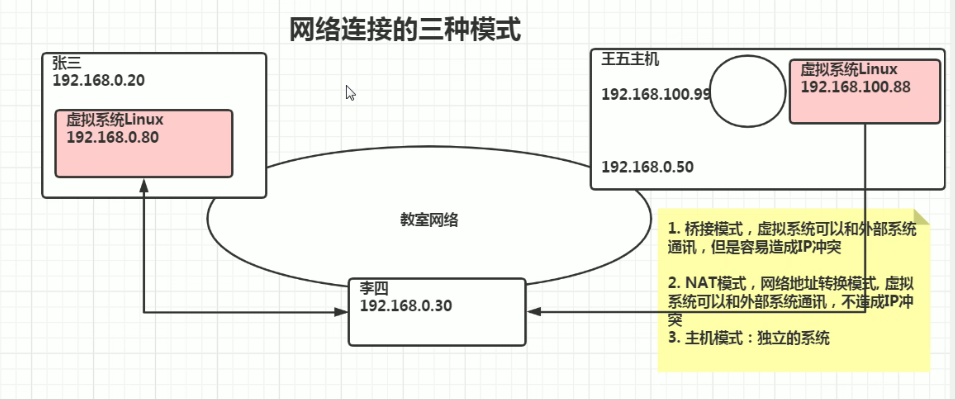
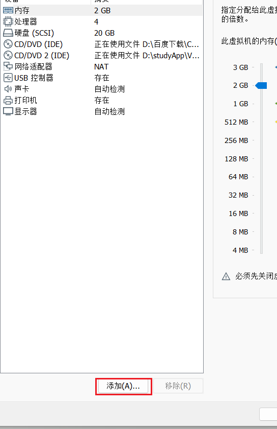

## 1.centOS安装

把最小安装改成桌面，并且选择附加选项

选中开发者工具会给你默认安装

gcc

jdk

mysql

2.自定义配置盘符

3.生产环境中打开

电脑崩溃时，记录状态

4.配置网络

5.关闭安全策略

6.开始安装

7.设置root密码

8.设置账户

因为默认不会使用root账户登录

所以要创建一个账户用于登录

属于权限比较低的二级用户

9.安装成功后重启电脑

10.同意许可

12.完成配置

13.登录

14.更改网络连接模式

建议NAT连接

15.安装vmtools

创建一个文件夹，让虚拟机和主机能够共享文件

首先弹出光驱

若

点击虚拟机此处为灰色

就点击设置

选择vmware下面的linux.ios文件

然点击确定，重启系统即可

此时就会出现安装包

双击进入

复制这个文件夹

注意登陆的一定要是root账户

不然没有权限粘贴

点击文件夹并

将刚才复制的安装包粘贴在此处

桌面右键打开终端

在本地计算机的d盘创建一个文件夹，并创建一个文件

然后打开虚拟机设置

然后打开文件夹

这个文件夹就是与主机共享的文件夹

此时无论是主机还是虚拟机，更改了myshell下面的文件

另一方都会发生变化

也可以在C盘创建一个文件夹，用虚拟机连接

与上面同样的操作

可以共享多个文件夹

## 2.xshell

1.下载

https://www.xshell.com/zh/free-for-home-school/

输入邮箱和姓名，把xshell与xftp都下载

qq邮箱会收到两个邮件，分别是xshell与xftp的下载地址

点进该地址即可下载

2.查询公网ip

也就是linux系统（我们所安装的centos）

在终端输入 ifconfig

在windows主机上去ping这个ip地址