- 介绍一下自己?

​		面试官好，

​		我叫韩栋

​		来自郑州工业应用技术学院

​		专业是计算机应用技术

​		这一次我要应聘的是web前端开发工程师

​		从事网络相关的工作呢

​		是我一直的梦想

​		为此大学阶段

​		我很早就结合前端开发的岗位的要求进行了准备

​		包括对html+css+js+vue+elementUI+小程序开发

​		在三年的时间内

​		我也重点选择了前端开发相关课程进行了研究

​		希望能加入公司

​		从事前端开发的工作

​		谢谢

- 之前做过哪些项目

    做过移动端的商城类项目，是一个在线购物平台，主要的是实现在线购物和生成订单的功能

    和这个购物平台的后台管理系统

    还有就是一个类似电影资讯，用户对于电影的一些评论反馈以及其他的一些东西

- 主要使用什么技术栈

    主要使用Vue，vue-router，vuex，axios，elementUI和es6


办公软件：飞书

​		功能：可以查进度，上传进度，会议

## A:http协议

TCP/IP 协议是传输层的一个面向连接的安全可靠的一个传输协议，三次握手的机制是为了保证能建立一个安全可靠的连接，那么第一次握手是由客户端发起，客户端会向服务端发送一个报文，在报文里面：SYN标志位置为1，表示发起新的连接。当服务端收到这个报文之后就知道客户端要和我建立一个新的连接，于是服务端就向客户端发送一个确认消息包，在这个消息包里面：ack标志位置为1，表示确认客户端发起的第一次连接请求。以上两次握手之后，对于客户端而言：已经明确了我既能给服务端成功发消息，也能成功收到服务端的响应。但是对于服务端而言：两次握手是不够的，因为到目前为止，服务端只知道一件事，客户端发给我的消息我能收到，但是我响应给客户端的消息，客户端能不能收到我是不知道的。所以，还需要进行第三次握手，第三次握手就是当客户端收到服务端发送的确认响应报文之后，还要继续去给服务端进行回应，也是一个ack标志位置1的确认消息。通过以上三次连接，不管是客户端还是服务端，都知道我既能给对方发送消息，也能收到对方的响应。那么，这个连接就被安全的建了。
四次挥手

四次握手机制也是由客户端去发起，客户端会发送一个报文，在报文里面FIN位标志位置一，当服务端收到这个报文之后，我就知道了客户端想要和我断开连接，但是此时服务端不一定能做好准备，因为当客户端发起断开连接的这个消息的时候，对于服务端而言，他和还有可能有未发送完的消息，他还要继续发送，所以呢，此时对于服务端而言，我只能进行一个消息确认，就是我先告诉服务端，我知道你要给我断开连接了，但是我这里边还可能没有做好准备，你需要等我一下，等会儿我会告诉你，于是呢，发完这个消息确认包之后，可能稍过片刻它就会继续发送一个断开连接的一个报文啊，也是一个FIN位置1的报文也是由服务端发给客户端的啊，这个报文表示服务端已经做好了断开连接的准备，那么当这个报文发给客户端的时候，客户端同样要给服务端继续发送一个消息确认的报文一共有四次，那么，通过这四次的相互沟通和连接，我就知道了，不管是服务端还是客户端都已经做好了断开连接的

输入地址并确认后，浏览器对域名进行访问，浏览器对域名进行解析，如果浏览器有域名对应的DNS相关信息的缓存，有的话可以拿到服务端的IP地址，如果没有的话，会去本地的host文件查看是否进行了配置，如果host文件没有配置相关的信息，那么就会发起DNS的请求用来获取对应的服务器的IP地址。应用端会构造DNS的请求报文，应用层会调用传输层的UDP的相关协议进行数据传输，会在DNS的基础上加上UDP的请求头然后传输信息至网络层，网络层会在UDP的请求报文基础上加上IP的请求头然后到数据链路层，数据链路层会实现二层寻址，会加上自己的mac信息和通过网络层的ARP协议里拿到的下一步基地的mac信息一起通过物理层一起传输出去，通常传到路由器，然后路由器这个三层设备最终会通过运营商的路线传输到下一个路由器地址，达到服务器后信息通过相同步骤进行层层解析HTTP的请求报文，然后构造HTTP响应报文沿着相同的步骤传输至客户端

## 1.什么是mvvm、mvc模型

**这两种都是设计模式而不是一种技术，**

**设计模式就是在Web开发过程中总结出的一些套路或者说是模板化的内容**

m：是model模型层，负责数据的存储和具体的业务逻辑

v：是view视图层，负责数据的展示，

vm：view model，视图模型层，负责连接model跟view，具有双向绑定，自动更新视图 

c：controller，控制器，只负责处理前后端的交互，v通知c让m去拉取数据，m拉取数据后，c通知v显示数据


**MVC和MVVM的区别并不是VM完全取代了C，只是在MVC的基础上增加了一层VM，只不过是弱化了C的概念，ViewModel存在目的在于抽离Controller中展示的业务逻辑，而不是替代Controller，其它视图操作业务等还是应该放在Controller中实现。也就是说MVVM实现的是业务逻辑组件的重用，使开发更高效，结构更清晰，增加代码的复用性。**

**对比**
Controller（应用逻辑控制层）：将用户View的操作反馈给Model，通知其进行数据更新，业务逻辑的中心。

View更新的时候，必须要通过Controller去更新一遍Model；同样的Model更新的时候，也要去更新一遍视图。此时开发者是在同时维护View层和Model层。当页面复杂的时候，开发者不得不做许多繁琐的工作来保证数据的状态、页面的展示都是正确的。

MVVM是解决了这个问题View更新的时候通过ViewModel影响Model，Model更新的时候通过ViewModel影响View，都是通过ViewModel作为处理中心，这样， 开发者的精力被释放，只要聚焦在业务逻辑中。


## 2.Vue双向绑定数据的原理

主要是通过使用数据劫持和发布订阅者模式来实现的

vue 会通过object.defineproty对data添加访问器属性getter/setter,
同时扫描el指定的区域生成虚拟Dom树,
当data里的变量被修改时,会触发set,set就会通知虚拟Dom树使用提前封装好的Dom操作将变量的新值,更新到页面中去

## 3.Vue的生命周期有哪些

一、创建前 / 后

在beforeCreate生命周期函数执行的时候，data和method 还没有初始化

在created 生命周期函数执行的时候，data和method已经初始化完成

二、渲染前/后

在beforeMount 生命周期函数执行的时候，已经编译好了模版字符串、但还没有真正渲染到页面中去

在mounted 生命周期函数执行的时候，已经渲染完，可以看到页面

三、数据更新前/后

在beforeUpdate生命周期函数执行的时候，已经可以拿到最新的数据，但还没渲染到视图中去。

在updated生命周期函数执行的时候，已经把更新后的数据渲染到视图中去了。

四、销毁前/后

在beforeDestroy 生命周期函数执行的时候，实例进入准备销毁的阶段、此时data 、methods 、指令等还是可用状态

在destroyed生命周期函数执行的时候，实例已经完成销毁、此时data 、methods 、指令等都不可用

## 4.v-if 和v-show

v-if 是“真正”的条件渲染，因为它会确保在切换过程中条件块内的事件监听器和子组件适当地被销毁和重建，操作的实际上是dom元素的创建或销毁。

v-show 就简单得多——不管初始条件是什么，元素总是会被渲染，并且只是简单地基于 CSS 进行切换

它操作的是display:none/block属性。

一般来说， v-if 有更高的切换开销，而 v-show 有更高的初始渲染开销。因此，如果需要非常频繁地

切换，则使用 v-show 较好；如果在运行时条件很少改变，则使用 v-if 较好。

## 5.async  await 是什么，有哪些作用

async await 是es7里面的新语法、它的作用就是 async 用于申明一个 function 是异步的，而 await 用于等待一个异步方法执行完成。它可以很好的替代promise 中的then

async 函数返回一个 Promise 对象，可以使用 then 方法添加回调函数。当函数执行的时候，一旦遇到 await 就会先返回，等到异步操作完成，再接着执行函数体内后面的语句。

## 6.**常用的数组方法有哪些？**

| 方法             | 作用                                                         |
| ---------------- | ------------------------------------------------------------ |
| concat(b)        | 连接字符串,b为被合并对象名,和+的作用一样，不修改字符串       |
| find()           | 方法返回数组中满足提供的测试函数的第一个元素的值。否则返回 [undefined](https://developer.mozilla.org/zh-CN/docs/Web/JavaScript/Reference/Global_Objects/undefined)[ ](https://developer.mozilla.org/zh-CN/docs/Web/JavaScript/Reference/Global_Objects/undefined) |
| findIndex()      | 方法返回数组中满足提供的测试函数的第一个元素的**索引**。否则返回-1。 |
| includes()       | 方法用来判断一个数组是否包含一个指定的值，根据情况，如果包含则返回 true，否则返回false。 |
| indexOf()        | 根据字符找到所在的下标位置（只返回第一个下标）；如果找不到，返回-1； |
| pop()            | 方法从数组中删除最后一个元素，并返回该元素的值。此方法更改数组的长度。 |
| push()           | 方法将一个或多个元素添加到数组的末尾，并返回该数组的新长度。 |
| shift()          | 方法从数组中删除**第一个**元素，并返回该元素的值。此方法更改数组的长度。 |
| unshift()        | 方法将一个或多个元素添加到数组的**开头**，并返回该数组的**新长度****(****该**方法修改原有数组**)**。 |
| slice(start,end) | 通过索引位置获取新的数组，该方法不会修改原数组，只是返回一个新的子数组 |
| reverse()        | 方法将数组中元素的位置颠倒，并返回该数组。该方法会改变原数组。 |
| sort()           | 方法用[原地算法](https://en.wikipedia.org/wiki/In-place_algorithm)对数组的元素进行排序，并返回数组。默认排序顺序是在将元素转换为字符串，然后比较它们的UTF-16代码单元值序列时构建的 |

1. 提取首字母转换为大写并与其余的字母拼接起来(3种方法)

                                   var name = name.charAt(0).toUpperCase() + name.slice(1); 
                                   var name = name.slice(0,1).toUpperCase() + name.slice(1);
                                   var name = name.subString(0,1).toUpperCase() + name.subString(1);

## 7.**数组有哪几种循环方式？分别有什么作用？**

| every()   | 方法测试一个数组内的所有元素是否都能通过某个指定函数的测试。它返回一个布尔值 |
| --------- | ------------------------------------------------------------ |
| filter()  | 方法创建一个新数组, 其包含通过所提供函数实现的测试的所有元素。 |
| forEach() | 方法对数组的每个元素执行一次提供的函数。                     |
| some()    | 方法测试是否至少有一个元素可以通过被提供的函数方法。该方法返回一个Boolean类型的值 |

## 8.常用的字符串方法

| 方法                | 作用                                                         |
| ------------------- | ------------------------------------------------------------ |
| charAt(a)           | 返回在指定位置的字符（注：字符串中第一个字符的下标是0,a代表下标） |
| replace(/a/,'b')    | 用于在字符串中用一些字符替换另一些字符，把a字符替换为b字符；/a/表示只替换匹配到的第一个a，/a/g，表示替换全部的a |
| split('')           | 把对象根据引号内的规则分割成字符串数组                       |
| indexOf(‘字符’)     | 根据字符找到所在的下标位置（只返回第一个下标）；如果找不到，返回-1； |
| lastIndexOf('字符‘) | 返回一个指定的字符串值最后出现的下标位置                     |
| join()              | 将数组合成字符串                                             |
| toLowerCase()       | 将所有字符变小写                                             |
| toUpperCase()       | 将所有字符变大写                                             |
| splice(start,end)   | 提取字符串的某个部分，并以新的字符串返回被提取的部分。<br/>start为要抽取的片断的起始下标，如果是负数，则从后超前取，-2为倒数第二个字符,<br/>end为抽取的片段的结尾的下标。若未指定此参数，则要提取的子串包括 start 到原字符串结尾的字符串。 |
| substr(start,end)   | 方法返回一个字符串中从指定位置开始到指定字符数的字符         |
| match()             | 方法检索返回一个字符串匹配正则表达式的的结果。               |
| trim()              | 移除字符串两侧的空白字符或其他预定义字符                     |

## A：什么是构造函数

在es6之前，对象不是基于类创建的，而是用一种构造函数的特殊函数来定义对象和他们的特征

创建对象的三种方式：

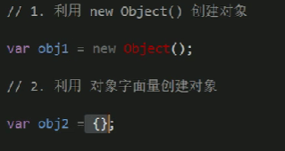

1.对象字面量

2.new Object()

3.自定义构造函数

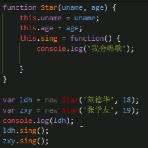

构造函数有两点需要注意

- 构造函数用于创建某一类对象，其首字母要大写
- 构造函数要和new一起使用才有意义

构造函数是一种特殊的函数，主要用来初始化对象，它总与new一起使用，我们把对象中的一些公共的属性和方法抽取出来，然后封装到这个函数里面，这个函数就叫做构造函数

**new会在执行时做四件事情**

1. 在内存中创建一个空对象
2. 让this指向这个新的对象
3. 执行构造函数里面的代码，给这个新对象添加属性和方法
4. 返会这个新对象（所以构造函数里面不需要return）

**构造函数中的属性和方法我们称为成员，而成员可以添加**

成员分为两类

1.实例成员

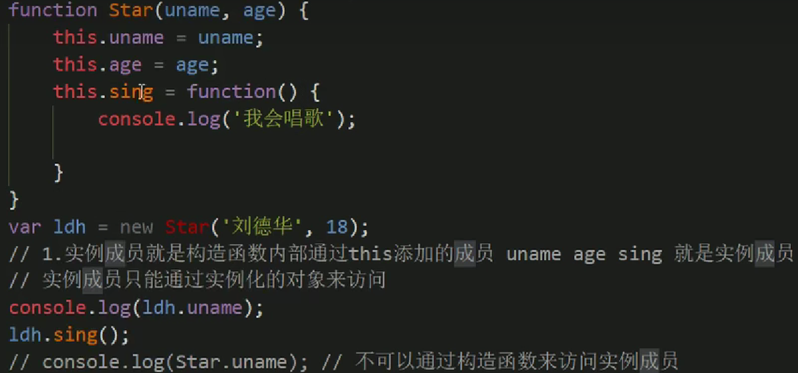

2.静态成员

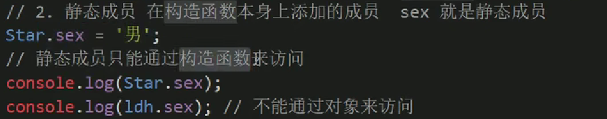

​	

**原型**

为什么需要原型：

因为构造函数里面直接放入方法的话，每实例化一次这个对象，都会为方法开辟一个新的内存空间

即便是相同的方法也会因为不同的实例而开辟新的内存空间，极大的浪费内存，所有我们在构造函数

上面默认有一个原型propotype，这里面专门放构造函数的方法，这样对象实例化之后的方法都指向原型，

节约内存空间

普通的变量直接储存在构造函数中即可

**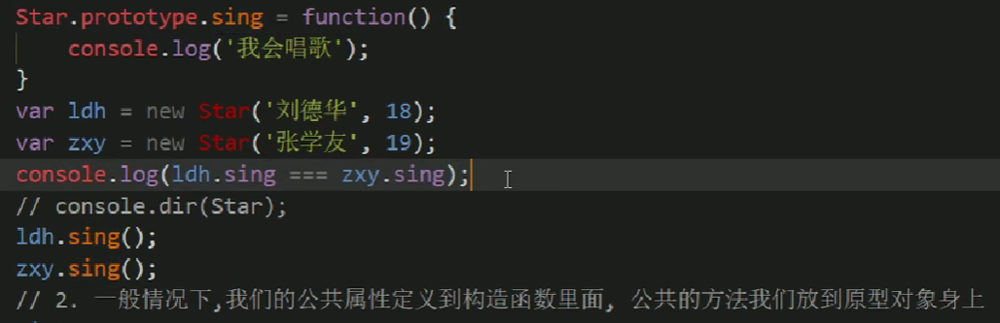**


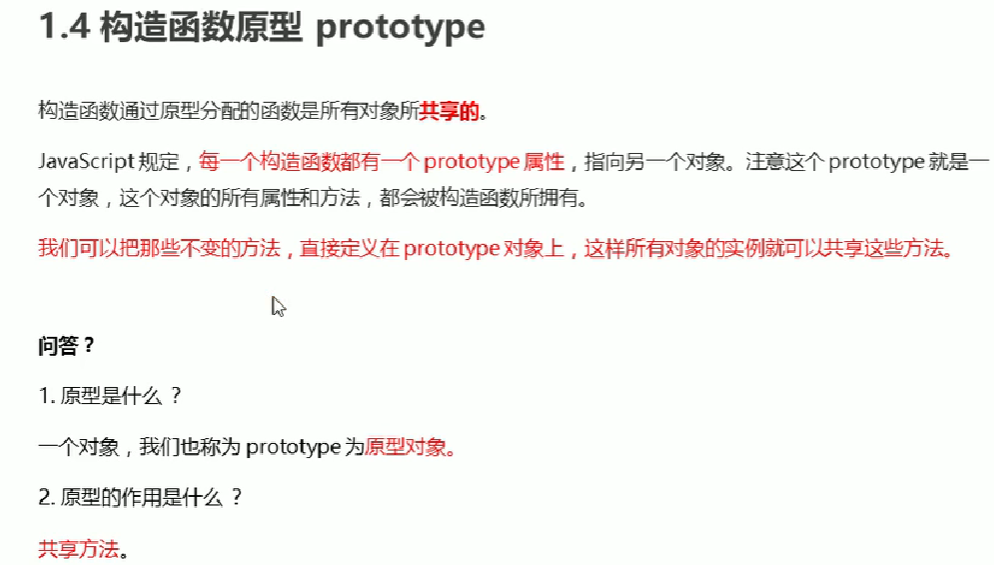

**对象原型**

为什么实例化的对象可以使用构造函数原型上面的方法

每一个构造函数实例化的对象上面都会有一个______proto__对象原型，它指向构造函数的prototype原型对象

当实例化的对象里面请求原型上面的方法时，就会去________proto____对象原型上面去找，而______proto__对象原型指向了

原型prototype，就可以使用原型上面的方法

此时实例化的对象就可以使用构造函数原型上面的方法

## 9.什么是原型链

优势：节省内存

**原型**：每一个实例对象上都有一个prototype属性，成为原型，

因为这个属性的值是个对象，也成为原型对象

作用：

1.存放一些属性和方法

2.在js中实现继承


**原型链**:

对象都有proto 属性,这个属性指向它的原型对象,原型对象也是对象,也有_proto 属性,指向原型对象的原型对象,这样一层一层形成的链式结构称为原型链，最顶层找不到则返回 null


## 10.什么是闭包？手写一个闭包函数？闭包有哪些优缺点？

**闭包（closure）**一个作用域可以访问另外一个函数内部的局部变量

1.闭包一定有return吗？

不一定，只有外部需要使用闭包内的变量，此时便需要 return 

闭包一定会内存泄漏吗?

- 并不是所有的闭包都会内存泄漏，而是需要看闭包有没有被外界所接受

  

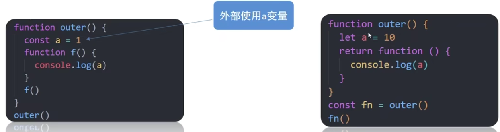

闭包应用：数据的私有，变量的私有化

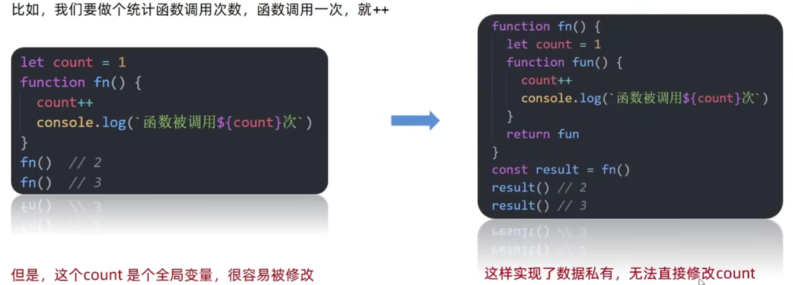


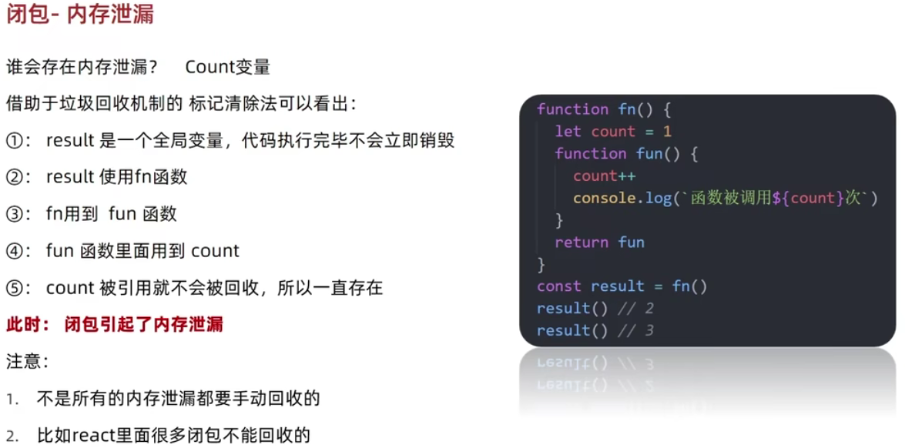

闭包内存泄漏也就是闭包里面的子函数一直在使用父函数的变量，便无法销毁

。

```js
function fn() {
                      var a = 100;
                     function son() {
                      //    console.log(a);
                             return a;
                     }
                return son();
 
         }
        var z=fn();
```

- 闭包的优点

    - 保护变量不被污染	

- 闭包的缺点

    - 滥用闭包函数会造成内存泄露（浏览器无法回收代码的内存）

        并不是所有的闭包都会内存泄漏，而是需要看闭包有没有被外界所接受

    - 因为闭包中引用到包裹在函数中定义的变量，
    
        而垃圾回收机制，只会回收变量。清空没被调用函数的作用域
    
        		只要形成闭包，作用域就不能被销毁，因为闭包存在的意义，就是保护闭包内的变量不被外部影响

​			  如果将函数内部的变量return出来，只是return出来这一个值

  			而闭包，return的是，整个闭包函数的作用域，提供给外部使用，依旧保持函数内部结构

- 因为闭包永远不会被释放，所以我们应该在必要的时候，及时释放这个闭包函数 

    ​				想要释放的时候，给该闭包函数，赋一个null值

    ```js
    		var z=fn();
    		z = ''
    ```

    

## 11.有那几种继承

其实原型链就是一个js面向对象的方式，他所有的继承都是基于原型链的，

像组合继承式是继承

还有原型继承

寄生组继承

class的类的继承

都算是继承的方式

上面几种哪一个是最好的、

class继承，就是extend这个继承，还有继承组合式继承是最好的

但是其实class源码也是用的这个继承组合式继承

## A.浏览器输入URL地址会发生什么事情

首先浏览器会进行一个DNS解析，就是把你输入的网址转成它对应的ip地址，然后进行TCP的建立

这时候看他是Http还是Https，如果是Htpps的话，它还会有一个SSR套阶层，这个主要是为了安全

然后会进行三次握手四次挥手，具体四次挥手的时间，看你设没设置keep alive属性，

如果没有设置的话，所有的请求都会进行三次握手四次挥手，就是会非常浪费时间

但是现在从Hppt1.0之后，所有的都会默认加keep alive 这个属性，然后当我们所有的访问http请求后，

他才进行这个四次挥手，然后所有的数据都会进行那个网络五次模型，然后拉数据，

如果是单页面开发的话，他会首先拉我们的Html文档，然后从上到下加载资源，

当加载到html的时候，它会自动生成Dom，当加载css的时候，它会进行css tree

stress tree 和 Dom tree 会同步解析，但是我们如果碰到js 的话，不论是js的下载还是解析

它都会阻塞整个html的渲染，那js内部执行又分为同步任务和异步任务，同步任务就是从上到下执行

但是碰到异步任务的话，它会放到队列里面，按照队列的顺序执行，异步任务又分为宏任务和微任务

像我们promise基本就是微任务

## A:什么时候用margin什么时候用padding

同级盒子一般都是用这个margin

但是子父盒子我们都是用padding

如果你子父用margin的话，会很容易出现这个margin塌陷的问题

出现margin用什么方式解决：最常用的方式就是overflow hidden

overflow hidden 的原理就是产生一个bfc，当我们产生一个bfc的时候，它就会按照bfc的块级格式化上下文的这个规则，去渲染我们的页面，这个渲染是分开的，它不存在这个margin塌陷，所有就可以解决margin 塌陷问题


## **12.后台管理系统中的权限管理是怎么实现的？**

登录：当用户填写完账号和密码后向服务端验证是否正确，验证通过之后，服务端会返回一个**token**，

拿到token之后（我会将这个token存贮到cookie中，保证刷新页面后能记住用户登录状态），前端会

根据token再去拉取一个 **user_info** 的接口来获取用户的详细信息（如用户权限，用户名等等信息）。

权限验证：通过token获取用户对应的 权限，动态根据用户的 权限算出其对应有权限的路由，通过

**router.addRoutes** 动态挂载这些路由。

具体思路：

登录成功后，服务端会返回一个 **token**（该token的是一个能唯一标示用户身份的一个key)，之后我

们将token存储在本地cookie之中，这样下次打开页面或者刷新页面的时候能记住用户的登录状态，不

用再去登录页面重新登录了。

ps:为了保证安全性，我司现在后台所有token有效期(Expires/Max-Age)都是Session，就是当浏览器关

闭了就丢失了。重新打开游览器都需要重新登录验证，后端也会在每周固定一个时间点重新刷新

token，让后台用户全部重新登录一次，确保后台用户不会因为电脑遗失或者其它原因被人随意使用账

号。

用户登录成功之后，我们会在全局钩子 router.beforeEach 中拦截路由，判断是否已获得token，在

获得token之后我们就要去获取用户的基本信息了

页面会先从 cookie 中查看是否存有 token，没有，就走一遍上一部分的流程重新登录，如果有token,

就会把这个 token 返给后端去拉取user_info，保证用户信息是最新的。 当然如果是做了单点登录得功

能的话，用户信息存储在本地也是可以的。当你一台电脑登录时，另一台会被提下线，所以总会重新登

录获取最新的内容。

先说一说我权限控制的主体思路，前端会有一份路由表，它表示了每一个路由可访问的权限。当用户登

录之后，通过 **token** 获取用户的 **role** ，动态根据用户的 **role** 算出其对应有权限的路由，再通过

 router.addRoutes 动态挂载路由。但这些控制都只是页面级的，说白了前端再怎么做权限控制都不是

绝对安全的，后端的权限验证是逃不掉的。

我司现在就是前端来控制页面级的权限，不同权限的用户显示不同的侧边栏和限制其所能进入的页面(也

做了少许按钮级别的权限控制)，后端则会验证每一个涉及请求的操作，验证其是否有该操作的权限，每

一个后台的请求不管是 get 还是 post 都会让前端在请求 header 里面携带用户的 **token**，后端会根据

该 **token** 来验证用户是否有权限执行该操作。若没有权限则抛出一个对应的状态码，前端检测到该状

态码，做出相对应的操作。

使用vuex管理路由表，根据vuex中可访问的路由渲染侧边栏组件。

具体实现：

创建vue实例的时候将vue-router挂载，但这个时候vue-router挂载一些登录或者不用权限的公用的页 面。

当用户登录后，获取用role，将role和路由表每个页面的需要的权限作比较，生成最终用户可访问的路 由表。

添加用调户用可r访ou问te的r .路ad由dR。outes(store.getters.addRouters)

由渲染侧边使栏用组v件u。ex管理路由表，根据

## 14.es6有哪些新特性

ES6是2015年推出的一个新的版本、这个版本相对于ES5的语法做了很多的优化、例如：新增了let、 const

let和const具有块级作用域，不存在变量提升的问题。新增了箭头函数，简化了定义函数的写法，同时

可以巧用箭头函数的this、（注意箭头函数本身没有this,它的this取决于外部的环境），新增了promise

解决了回调地狱的问题，新增了模块化、利用import 、export来实现导入、导出。新增了结构赋值，

ES6 允许按照一定模式，从数组和对象中提取值，对变量进行赋值，这被称为解构

（Destructuring）。新增了class类的概念，它类似于对象。

## **15**.v-for **循环为什么一定要绑定**key**?**

页面上的标签都对应具体的虚拟dom对象(虚拟dom就是js对象), 循环中 ,如果没有唯一key , 页面上删除一条标签, 由于并不知道删除的是那一条! 所以要把全部虚拟dom重新渲染, 如果知道key为x标签被删除掉, 只需要把渲染的dom为x的标签去掉即可!

## **16**.组件中的data为什么要定义成一个函数而不是一个对象？

每个组件都是 Vue 的实例。组件共享 data 属性，当 data 的值是同一个引用类型的值时，改变其中一 个会影响其他

## 17.常见的盒子垂直居中的方法有哪些

1.**利用子绝父相**

```css
 #container{
 width:500px;
 height:500px;
 position:relative;
 }
 #center{
 width:100px;
 hight:100px;
 position: absolute;
 top: 50%;
 left: 50%;
 margin-top:-50px;
 margin-left:-50px;
 }

```

2.**css3的transform**

```css
 #container{
 position:relative;
 }
 #center{
 position: absolute;
 top: 50%;
 left: 50%;
 transform: translate(-50%, -50%);
 }

```

3.**弹性盒子**

```css
 #container{
 display:flex;
 justify-content:center;
 align-items: center;
 }

```

## 18.平时都是用什么实现跨域 

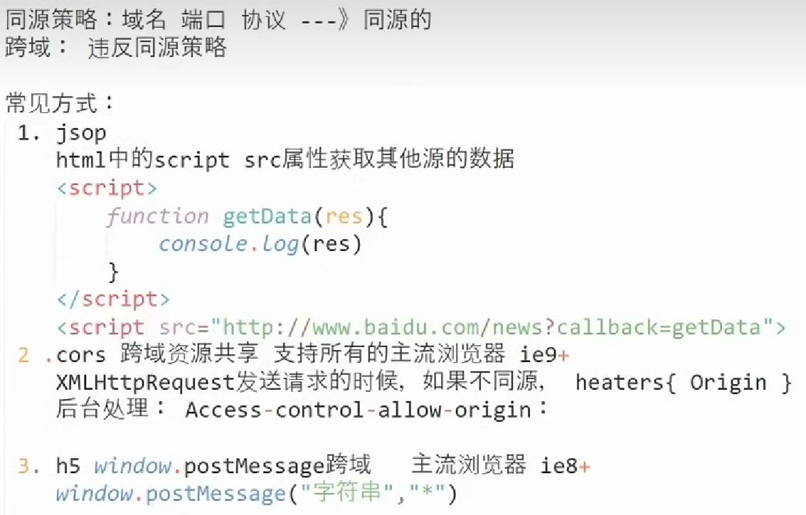

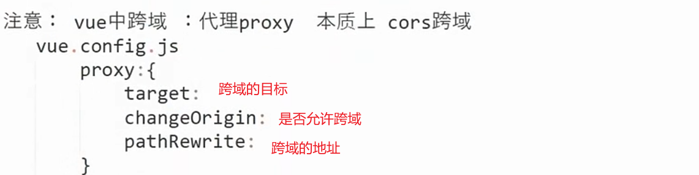

## 19.cookie、LocalStorage、sessionStorage的区别

**与服务器交互：**

 cookie 是网站为了标示用户身份而储存在用户本地终端上的数据（通常经过加密）

 cookie 始终会在同源 http 请求头中携带（即使不需要），在浏览器和服务器间来回传递

 sessionStorage 和 localStorage 不会自动把数据发给服务器，仅在本地保存

**存储大小：**

cookie 数据根据不同浏览器限制，大小一般不能超过 4k

sessionStorage 和 localStorage 虽然也有存储大小的限制，但比cookie大得多，可以达到5M或 更大

**有期时间：**

localStorage 存储持久数据，浏览器关闭后数据不丢失除非主动删除数据

sessionStorage 数据在当前浏览器窗口关闭后自动删除

cookie 设置的cookie过期时间之前一直有效，与浏览器是否关闭无关

## 20.this的指向有哪些

js的作用域，同样名称的变量和函数，引用时默认是变量，变量大于函数

1.**作为函数被调用**

​	当函数作为普通函数被调用时，分为两种情况

- 在非严格模式下，this指向window

- 在严格模式下，this指向undefined

2.**作为方法被调用时**

​    什么叫方法：即函数作为对象的属性包裹在对象里面，此时对象里面的函数叫做方法

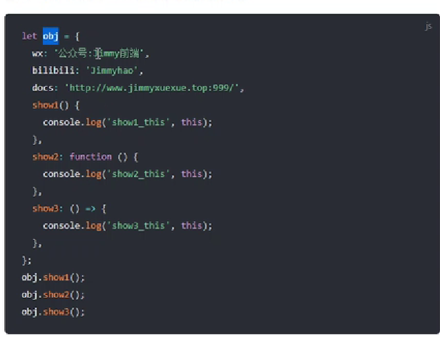

- 当通过方法被调用时，this指向方法的拥有者，也就是该对象

- 如果是箭头函数作为方法存在对象中，因为箭头函数本身没有this指向，它的this继承于父亲

  这里因为箭头函数作为方法包裹在对象里面，那么箭头函数的父亲就是该对象，箭头函数的

  this指向有该对象决定，又因为该对象为全局的，指向为window，所有该箭头函数也指向window

**3.作为构造函数被调用时**

一个构造函数在 new 的过程主要发生了以下几件事:

1. 在内存中创建一个空对象
2. 让this指向这个新的对象
3. 执行构造函数里面的代码，给这个新对象添加属性和方法
4. 返会这个新对象（所以构造函数里面不需要return）

- 当构造函数返回的为值或者字符串时，this 走到还是正常初始化流程，return的无效

- 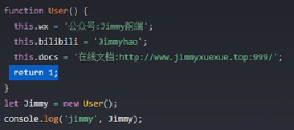

  输出的仍为公众号在线文档

- 当构造函数返回的时对象时，会忽略掉初始化的流程，直接将返回值作为 new 的结果进行返回

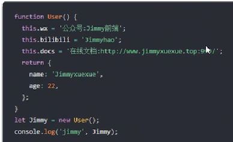

​       输出的为name age  而不是公众号在线文档

**4.通过call 与 apply修改函数中this的指向问题**

当我们通过 call 和 apply 来this的指向时，不传任何参数，则默认为将this指向修改为 windows

这两个也是开发中常用的方法，如果有阅读他人源码时会发现使用的更加之多，二者的区别主要在于：

- call 在修改 this 如果需要传参数需要一个一个传

  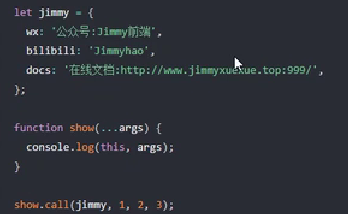

- apply在修改this时 传递的参数必须是一个数组

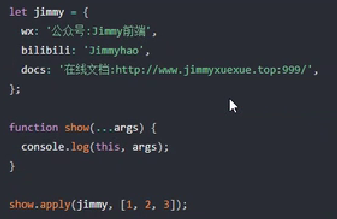

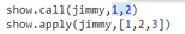

如果不传参二者基本无区别


1、普通函数中的this指向window

2、定时器中的this指向window

3、箭头函数没有this,它的this指向取决于外部环境、

4、事件中的this指向事件的调用者

5、构造函数中this和原型对象中的this,都是指向构造函数new 出来实例对象

6、类 class中的this 指向由constructor构造器new出来的实例对象

7、自调用函数中的this 指向window

## 21.**什么是递归，递归有哪些优点或缺点？**


递归：如果一个函数在内部可以调用其本身，那么这个函数就是递归函数。

简单理解:函数内部自己调用自己, 这个函数就是递归函数

优点：结构清晰、可读性强

缺点：效率低、调用栈可能会溢出，其实每一次函数调用会在内存栈中分配空间，而每个进程的栈的容 量是有限的，当调用的层次太多时，就会超出栈的容量，从而导致栈溢出

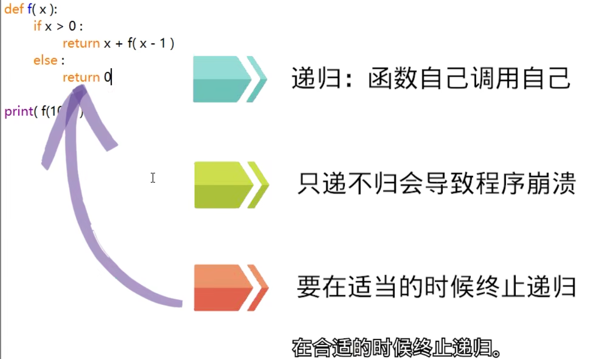

## A:vue性能优化

1. **函数型组件**

   就是在组件template标签里面添加一个functional，functional什么意思呢？

   因为组件在渲染的时候会很多生命周期的耗时处理，如果用右面的functional，那么生命周期的处理

   将不再进行操作，而是将生命周期作为一个函数进行处理，从而提高页面渲染速度

   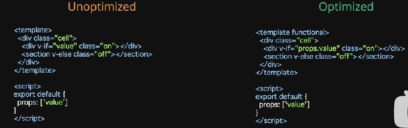

**2.子组件拆分**

重处理

重处理不能放到本组件当中，过于耗时

将其放入子组件当中，会提升允许效率

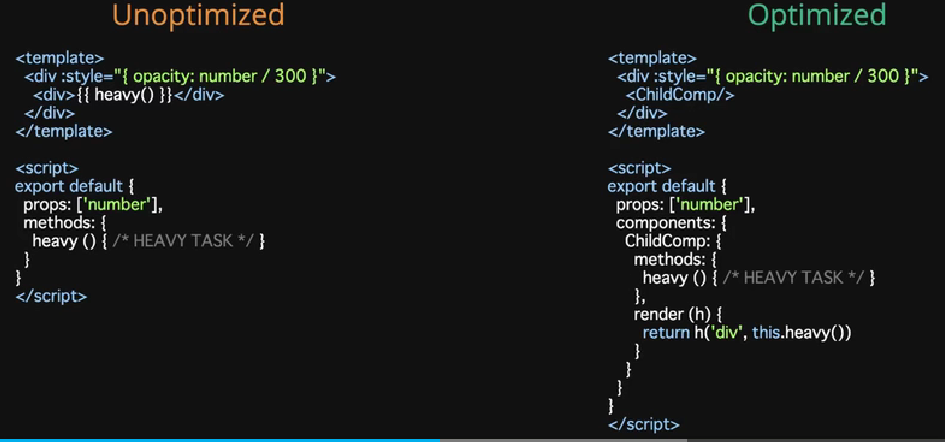

**3.局部变量**

就是将需要的计算属性赋给一个新的变量，然后引用时只引用这个变量即可，减少对计算属性的调用次数

从而提高运行效率

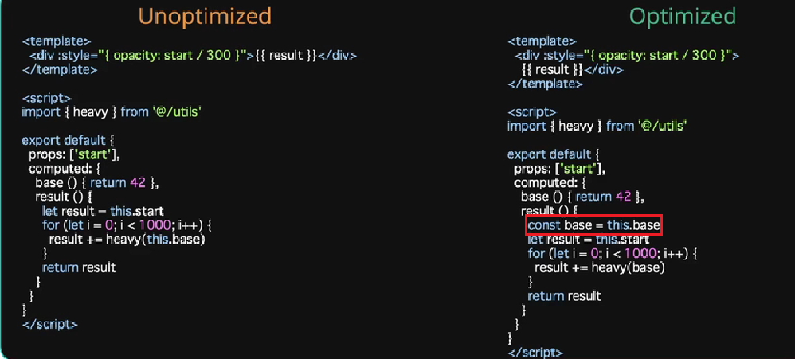

**4.活用v-show 减少v-if**

v-if是操作Dom树，这样效率比较慢，而用v-show是用css的display来对标签进行隐藏显示，效率比较快

**5.使用keep-alive**

它包裹动态组件时，会缓存不活动的组件实例，而不是销毁它们

例如：在开发中经常有从列表跳到详情页，然后返回详情页的时候需要缓存列表页的状态（比如滚动位置信息），这个时候就需要保存状态，要缓存状态。在组件切换过程中将状态保留在内存中，防止重复渲染DOM，减少加载时间及性能消耗

包裹路由出口组件

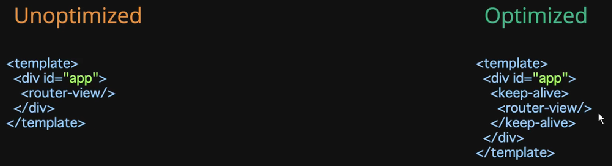

**6.活用延迟装载（Defer）**

该方法并不能提高运行效率，只是能让用户看起来感觉页面上的内容更快了  

用mixins（混合器）让一部分逻辑先执行，一部分逻辑延迟执行

大部分都是网页上的一些耗时处理，defer将这些处理顺序执行

达到看起来很快的效果，但是实际上内部处理并没有快，只是延迟处理

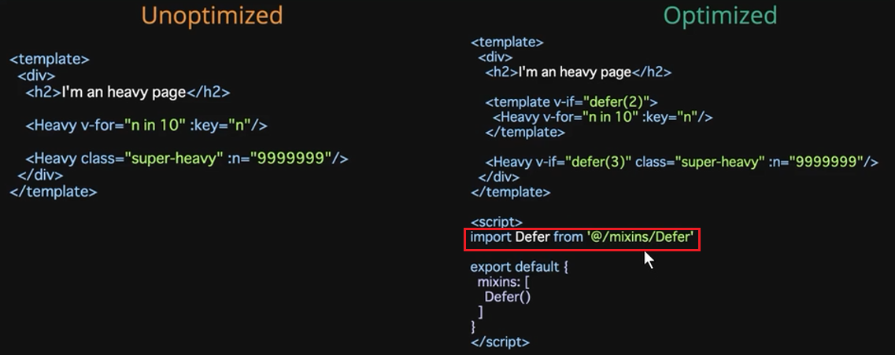

**7.分批处理**（Time slicing）

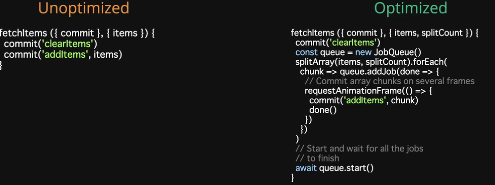

8.**非响应模式**（非观察模式，non-reactive）

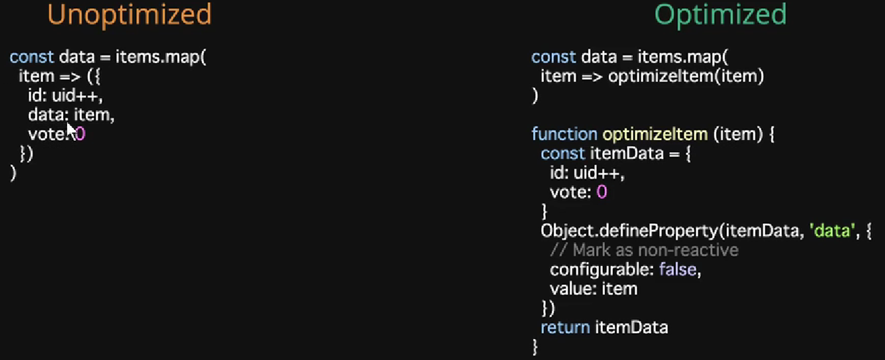

9.仅渲染可视化部分

类似懒加载

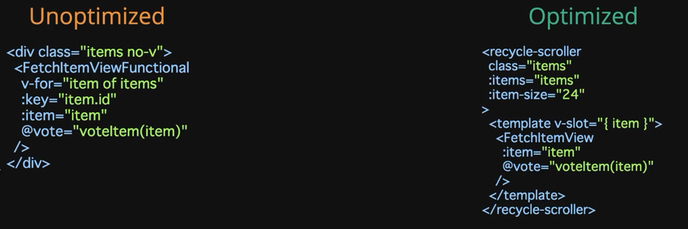

## 22.**性能优化**

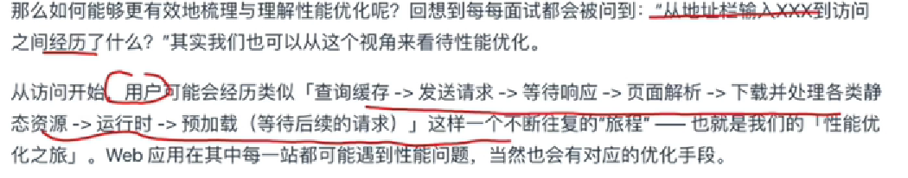

**1.减少HTTP请求**
数据量不大的页面，就减少 http 请求数量，一次性返回过来，对于数据量大的页面，可以分段异步请 求，让用户先看到一部分，再继续加载另外一部分
http 协议是 无状态 的应用层协议，意味着 每次 http 请求都需要建立通信链路、进行数据传输 ，而在 服务 器端 ，每个 http 都需要启动 独立的线程 去处理。这些通信和服务的开销都很昂贵，减少 http 请求的数目可有效提高访问性能。
2 **.合并CSS、合并javascript、合并图片**
将浏览器一次访问需要的 javascript 和 CSS 合并成一个文件，这样浏览器就只需要一次请求。图片也可以 合并，多张图片合并成一张，如果每张图片都有不同的超链接，可通过CSS 偏移响应鼠标点击操作，构造不同的URL
3.**合理设置缓存**
很少变化的图片资源可以直接通过 HTTP Header 中的 Expires 设置一个很长的过期头 ; 变化不频繁而又可能会变的资源可以使用 Last-Modifed 来做请求验证。尽可能的让资源能够在缓存中待得更久
4.**将更新频率比较低的CSS、javascript、logo、图标等静态资源文件缓存在浏览器中**
避免频繁的 http 请求。通过设置 http 头中的 cache-control 和 expires 的属性，可设定浏览器缓存，缓存时 间可以是数天，甚至是几个月
6.**CSS放在页面最上部，javascript放在页面最下面**
浏览器会在下载完成全部 CSS 之后才对整个页面进行渲染，因此最好的做法是将 CSS 放在页面最上面，让 浏览器尽快下载CSS 。如果将 CSS 放在其他地方比如 BODY 中，则浏览器有可能还未下载和解析到 CSS 就已经开始渲染页面了，这就导致页面由无 CSS 状态跳转到 CSS 状态，用户体验比较糟糕，所以可以考虑将CSS 放在 HEAD 中。
Javascript 则相反，浏览器在加载 javascript 后立即执行，有可能会阻塞整个页面，造成页面显示缓慢， 因此javascript 最好放在页面最下面。但如果页面解析时就需要用到 javascript ，这时放到底部就不合适了
7.**减少作用域链查找**
前文谈到了作用域链查找问题，这一点在循环中是尤其需要注意的问题。如果在循环中需要访问非本作用域下的变量时请在遍历之前用局部变量缓存该变量，并在遍历结束后再重写那个变量，这一点对全局变量尤其重要，因为全局变量处于作用域链的最顶端，访问时的查找次数是最多的。
8.**css和注释**
尽量减少页面中的空格和注释，从而减少页面的大小。对于 css 、 js 可以使用压缩工具进行压缩后再发布
9.**CSS Sprites（精灵图 || 雪碧图 ）**
很多的小图片整合成一张大图，通过 css 来移动位置显示，从而减少向服务器请求数据的次数
10.**减少dom请求**
页面的 dom 层级尽量的减少，没有用的，多余的 dom 层级都移除掉，越简洁运行越快
11.**节流和防抖**
防抖是控制次数，节流是控制频率
函数防抖和节流 是优化 高频率 执行 js 代码的一种手段， js 中的一些事件如浏览器的 resize 、 scroll ，鼠标的 mousemove 、 mouseover ， input 输入框的 keypress 等事件在触发时，会不断地调用绑定在事件上的回调函数，极大地浪费资源，降低前端性能。为了优化体验，需要对这类事件进行调用次数的限制
防抖（debounce）
防抖和节流的作用都是防止函数多次调用。区别在于，假设一个用户一直触发这个函数，且每次触发函数的间隔小于wait ，防抖的情况下只会调用一次，而节流的 情况会每隔一定时间（参数 wait ）调用函数。
延迟的抖动函数

该实现思路很简单，就是将执行函数放到一个定时器中，如果在定时器触发之前没有事件执
行，那么就触发该执行函数，否则清空定时器
这是一个简单版的防抖，但是有缺陷，这个防抖只能在最后调用。一般的防抖会有immediate选项，表示是否立即调用
总结

对于按钮防点击来说的实现：如果函数是立即执行的，就立即调用，如果函数是延迟执行的，
就缓存上下文和参数，放到延迟函数中去执行。一旦我开始一个定时器，只要我定时器还在，
你每次点击我都重新计时。一旦你点累了，定时器时间到，定时器重置为 null ，就可以再次
点击了。
对于延时执行函数来说的实现：清除定时器 ID ，如果是延迟调用就调用函数
**节流（throttle）**
防抖动和节流本质是不一样的。防抖动是将多次执行变为最后一次执行，节流是将多次执行变成每隔一段时间执行。
所谓节流，就是指连续触发事件但是在 n 秒中只执行一次函数。节流会稀释函数的执行频率。
使用时间戳的节流方案

**12.cdn加载包**

生产环境中，将项目依赖的一些第三方包替换成通过 cdn 方式外部加载，而不是打包到 vender，对于提升应用的加载、响应速度很有意义

## 23.vue实例是挂载到那个标签上的？

vue实例最后会挂载在body标签里面，所以我们在vue中是获取不了body 标签的，如果要使用body标 签的话需要用原生的方式获取

## 24.浅深拷贝

**浅拷贝：**

数组a

b复制了a，但是修改数组a里面的值，数组b也会变化，这是因为b只是复制了a的引用地址

有两类数据储存方式

**a.基本类型--名和值都存储在栈内存中**，例如let a=1;


当你b=a复制时，栈内存会新开辟一个内存，例如这样：


  	

所以当你此时修改a=2，对b并不会造成影响，因为此时的b已自食其力，翅膀硬了，不受a的影响了。当然，let a=1,b=a;虽然b不受a影响，但这也算不上深拷贝，因为深拷贝本身只针对较为复杂的object类型数据。

**b.引用数据类型--名存在栈内存中，值存在于堆内存中，但是栈内存会提供一个引用的地址指向堆内存中的值**，我们以上面浅拷贝的例子画个图：


当b=a进行拷贝时，其实复制的是a的引用地址，而并非堆里面的值。

而当我们**a[0]=1**时进行数组修改时，由于a与b指向的是同一个地址，所以自然b也受了影响，这就是所谓的浅拷贝了。


那，要是在堆内存中也开辟一个新的val内存专门为b存放值，就像基本类型那样，岂不就达到深拷贝的效果了


**深拷贝：**

数组a：[1,2,3,[a,b,c]]

数组b复制数组a，此时修改数组a的值，数组b不再受到影响

因为深拷贝是拷贝对象各个层级的属性，

什么是各个层级？

就是1，2，3都属于第一个层级，而[a,b,c]则属于第二个层级

那么js的slice方法拷贝到数组算不算深拷贝呢？

回答是不算，因素slice方法虽然是开辟了一个新的内存空间，但是它只拷贝了第一个层级的属性

如1，2，3，而第二个层级的[a,b,c]则没有拷贝，而是引用的内存地址

**那么有哪些方法可以实现深拷贝呢**

1.递归调用

```js
  // 封装一个递归调用深拷贝函数 deepCopy
const deepCopy = (obj) => {
  // 判断传入的值是否为一个对象
  if (obj === null && typeof obj !== "object") {
    return obj;
  }
  // 判断对象的类型 注意这里不考虑包装类对象
  if (Object.prototype.toString.call(obj) === "[object Date]") {
    return new Date(obj);
  }
  if (Object.prototype.toString.call(obj) === "[object RegExp]") {
    return new RegExp(obj);
  }
  if (Object.prototype.toString.call(obj) === "[object Undefined]") {
    return new Error(obj);
  }
  // 判断对象是类
  let newObj = Array.isArray(obj)  ? [] : {}
  for(let item in obj){
    if(typeof obj[item] === 'object') {
        newObj[item] = deepCopy(obj[item])
    }else {
        newObj[item] = obj[item]
    }
  }
  return newObj
};

const foo = {
    name: '张三',
    info: {
        age: 24
    }
}
const newFoo = deepCopy(foo)
console.log(foo, newFoo)
foo.info.age = 25
console.log(foo, newFoo)
```

2.JSON.stringify + JSON.parse

3.[lodash](https://so.csdn.net/so/search?q=lodash&spm=1001.2101.3001.7020)

```js
const _ = require('lodash')
const foo = {
    name: '张三',
    info: {
        age: 24
    }
}
const newFoo = _.cloneDeep(foo);
foo.info.age = 25
console.log(foo, newFoo) // { name: '张三', info: { age: 25 } } { name: '张三', info: { age: 24 } }

```

4.Object.assgin

```js
//注意：只有当对象中没有嵌套对象时，才可以实现深拷贝
const foo = {
    name: '张三',
    age: 24
}
const newFoo = Object.assign({}, foo)
foo.age = 25
console.log(foo, newFoo) // {name: '张三', age: 25} {name: '张三', age: 24}

// 对象中有内嵌的对象时
const foo = {
    name: '张三',
    info: {
        age: 24
    }
}
const newFoo = Object.assign({}, foo)
foo.info.age = 25
console.log(foo, newFoo) // { name: '张三', info: { age: 25 } } { name: '张三', info: { age: 25 } }

```

5.structuredClone

```js
const foo = {
    name: '张三',
    info: {
        age: 24
    }
}
const newFoo = structuredClone(foo) // 
foo.info.age = 25
console.log(foo, newFoo) // { name: '张三', info: { age: 25 } } { name: '张三', info: { age: 24 } }

```

## 25.js的执行机制是怎样的

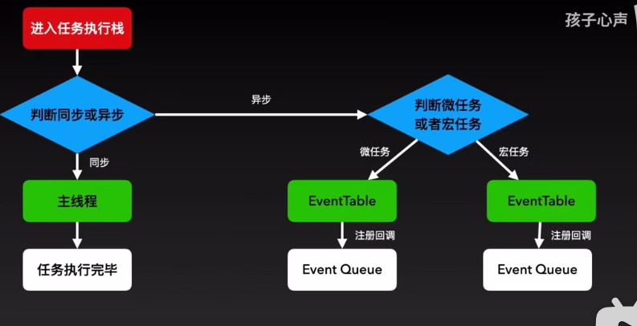

所有任务可以分成两种，一种是**同步任务**（synchronous），

同步任务指的是，在主线程上排队执行的任务，只有前一个任务执行完毕，才能执行后一个任务。

另一种是**异步任务**（asynchronous），

异步任务又分为**微任务和宏任务**，

微任务需要立即连贯执行（如Promise.then），

宏任务不需要立即连贯执行(如setTimeout)，

微任务需要在下一个宏任务执行前完成

异步任务指的是，不进入主线程、而进入"任务队列"（task queue）的任务，只有"任务队列"通知主线程，

某个异步任务可以执行了，该任务才会进入主线程执行。

## 26.数组去重（三种方式）

```js
  //方式一 new Set
    var arr1 = [5,1,2,3,4,1,3]
    console.log( Array.from(new Set(arr1)));
    console.log( [...new Set(arr1)]);
    // 将其封装成去重函数
    function unique(arr){
        return [...new Set(arr)]
    }
    console.log(unique(arr1));

  //方式二  indexOf
    function unique2(arr){
        var brr = []
        for(var i=0;i<arr.length;i++){
            // 如果brr数组里面没有该值，则追加该值，如果有，则跳过
            if(brr.indexOf(arr[i]) == -1){
                brr.push(arr[i])
            }
        }
        return brr
    }
    console.log(unique2(arr1));

  //方式三 sort
    function unique3(arr){
        var crr = [];
        // sort将数组从小到大依次排序，相同的值会被放在一起
        // 判断如果该索引与其前一个索引的值如果不相等，就将该索引的值放入新数组，
        // 如果相等，则除了第一个写入新数组之外，其他的都无法进去判断
        arr = arr.sort();
        for(var i = 0;i<arr.length;i++){
            if(arr[i] !== arr[i-1]){
                crr.push(arr[i])
            }
        }
        return crr
    }
    console.log(unique3(arr1));
```

## 27.数组排序（两种方式）

 1.选择排序

基本思想：首先在未排序数组中找到最小(大)元素，存放在数组的起始位置。
          		再从剩余数组元素中继续寻找最小(大)元素，返回放在已排序数组的末尾
        		  重复第二步，直到所有元素都排序完成


```js
 var arr = [ 2,3,45,3,54,323,233]
    function uniper(arr){
        var brr = [];
        for(var m=0;m<arr.length;m++){
            for(var n=m+1;n<arr.length;n++){
                // 将第一个值后面的所有的值都与其相比，如果有小于第一个值的
                // 那么就将第一个值赋给一个新变量，然后让第一个值等于后面小于它的值
                // 然后让小于它的值的所在的索引的数据等于第一个值
                if(arr[n]<arr[m]){
                    var i = arr[m];
                    arr[m] = arr[n];
                    arr[n] = i
                }
            }
        }
        return arr
    }
    console.log(uniper(arr));
```

2.冒泡排序

基本思想：一次比较两个相邻的数，如果不符合规则互换位置，一次比较就能够将最大或最小的值放在数组最后一位
         继续对除**【最后一位】**之外的所有元素重复上述过程


```js
var arr = [ 2,3,45,3,54,323,233]
    function uniper2(arr){
        for(var i = 0;i<arr.length;i++){
            if(arr[i]>arr[i+1]){
                var u = arr[i];
                arr[i] = arr[i+1];
                arr[i+1] = u
            }
        }
        return arr
    }
    console.log(uniper(arr));
```

## 28.什么是lodash，有哪些常见的API

[Lodash](https://so.csdn.net/so/search?q=Lodash&spm=1001.2101.3001.7020) 是一个一致性、模块化、高性能的 JavaScript 实用工具库。它内部封装了诸多对字符串、数组、对象等常见数据类型的处理函数,

**1.  _.chunk(array, [size=1]) “数组切割”**
将数组（array）拆分成多个 size 长度的区块，并将这些区块组成一个新数组。 如果array 无法被分割成全部等长的区块，那么最后剩余的元素将组成一个区块。

```js
// => [['a', 'b'], ['c', 'd']]

_.chunk(['a', 'b', 'c', 'd'], 3);
// => [['a', 'b', 'c'], ['d']]
```

**2.  _.cloneDeep(value) “深拷贝”**
这个方法类似_.clone，除了它会递归拷贝 value。（注：也叫深拷贝）。

```js
var objects = [{ 'a': 1 }, { 'b': 2 }];

var deep = _.cloneDeep(objects);
console.log(deep[0] === objects[0]);
// => false
```

**3. _.compact(array) “过滤假值”**
创建一个新数组，包含原数组中所有的非假值元素。例如false, null,0, “”, undefined, 和 NaN 都是被认为是“假值”。

```js
.compact([0, 1, false, 2, '', 3]);
// => [1, 2, 3]
```


**4. __.remove(array, [predicate=_.identity]) “移除数组对象中指定元素”**
移除数组中predicate（断言）返回为真值的所有元素，并返回移除元素组成的数组。predicate（断言） 会传入3个参数： (value, index, array)。

Note: 和_.filter不同, 这个方法会改变数组 array。使用_.pull来根据提供的value值从数组中移除元素。

```js
var array = [1, 2, 3, 4];
var evens = _.remove(array, function(n) {
  return n % 2 == 0;
});

console.log(array);
// => [1, 3]

console.log(evens);
// => [2, 4]
```


**5. __.unionWith([arrays], [comparator]) “数组对象合并去重”
这个方法类似_**.union， 除了它接受一个 comparator 调用比较arrays数组的每一个元素。 comparator 调用时会传入2个参数： (arrVal, othVal)。

```js
var objects = [{ 'x': 1, 'y': 2 }, { 'x': 2, 'y': 1 }];
var others = [{ 'x': 1, 'y': 1 }, { 'x': 1, 'y': 2 }];

_.unionWith(objects, others, _.isEqual);
// => [{ 'x': 1, 'y': 2 }, { 'x': 2, 'y': 1 }, { 'x': 1, 'y': 1 }]

```

**6.  __.map(collection, [iteratee=_.identity]) “过滤”**
创建一个数组， value（值） 是 iteratee（迭代函数）遍历 collection（集合）中的每个元素后返回的结果。 iteratee（迭代函数）调用3个参数：
(value, index|key, collection).

```js
function square(n) {
  return n * n;
}

_.map([4, 8], square);
// => [16, 64]

_.map({ 'a': 4, 'b': 8 }, square);
// => [16, 64] (iteration order is not guaranteed)

var users = [
  { 'user': 'barney' },
  { 'user': 'fred' }
];

// The `_.property` iteratee shorthand.
_.map(users, 'user');
// => ['barney', 'fred']

```


7_.uniqBy(array, [iteratee=_.identity]) “数组对象去重”
这个方法类似_.uniq ，除了它接受一个 iteratee （迭代函数），调用每一个数组（array）的每个元素以产生唯一性计算的标准。iteratee 调用时会传入一个参数：(value)。

```js
_.uniqBy([2.1, 1.2, 2.3], Math.floor);
// => [2.1, 1.2]

// The `_.property` iteratee shorthand.
_.uniqBy([{ 'x': 1 }, { 'x': 2 }, { 'x': 1 }], 'x');
// => [{ 'x': 1 }, { 'x': 2 }]
```


**8. _.pullAll(array, values) “移除数组指定元素”**
这个方法类似_.pull，区别是这个方法接收一个要移除值的数组。

Note: 不同于_.difference, 这个方法会改变数组 array。

```js
var array = [1, 2, 3, 1, 2, 3];

_.pullAll(array, [2, 3]);
console.log(array);
// => [1, 1]
```


**9. _.pullAllWith(array, values, [comparator]) “移除数组对象指定元素”**
这个方法类似_.pull，区别是这个方法接收一个要移除值的数组。
Note: 不同于_.difference, 这个方法会改变数组 array。

```js
var array = [{ 'x': 1, 'y': 2 }, { 'x': 3, 'y': 4 }, { 'x': 5, 'y': 6 }];

_.pullAllWith(array, [{ 'x': 3, 'y': 4 }], _.isEqual);
console.log(array);
// => [{ 'x': 1, 'y': 2 }, { 'x': 5, 'y': 6 }]
```

## **29.**http的请求方式有哪些？

get、post、put、delete等

## 30.**平时都是用那些工具进行打包的？babel是什么？**

WebPack 是一个模块打包工具，你可以使用WebPack管理你的模块依赖，并编绎输出模块们所需的静

态文件。它能够很好地管理、打包Web开发中所用到的HTML、Javascript、CSS以及各种静态文件（图

片、字体等），让开发过程更加高效。对于不同类型的资源，webpack有对应的模块加载器。webpack

模块打包器会分析模块间的依赖关系，最后 生成了优化且合并后的静态资源

babel可以帮助我们转换一些当前浏览器不支持的语法，它会把这些语法转换为低版本的语法以便浏览 器识别。

## 31.谈谈 set，map是什么

set 是es6 提供的一种新的数据结构，类似一个集合，是储存对象的地方，里面的数据具有不可重复性

重复的数据只保留一个

有方法：

​			add()增加,delete()删除,has()查询,forEach()循环遍历

```js
 //集合，表示无重复值的有序数列
    let set = new Set();
    console.log(set);
    //添加元素
    set.add(1);
    set.add(2);
    set.add('2');
    set.add('2');
    set.add(4);
    set.add(['Hello','Words',3,3,3])
    //删除元素
    set.delete(4)
    console.log(set);
    //校验某个值是否在set中,如果有就返回true，如果没有，就返回false
    console.log(set.has('2'));
    //遍历集合
    set.forEach((val,key) => {
        //这里的输出结果是一样的，这是因为set的键名和键值是同一个值
        console.log(val);
        console.log(key);
    })
    //将set转为数组,可以用set直接为数组去重
    let set2 = new Set([1,2,3,3,4,5,5]);
        //利用展开运算符
        let arry = [...set2];
        console.log(arry);
    //注意：set中对象的引用无法被释放
    let set3 = new Set(),obj = {};
    set3.add(obj);
    //释放当前对象的引用
    obj = null;
    console.log(set3);

    //WeakSet，相比set少了许多方法，但是最基本的add  delete  has还是有的
    //1.不能传入非对象类型的参数
    //2.不可迭代（也就是不可遍历）
    //3.没有forEach()
    //4.没有size属性
    let set4 = new WeakSet(),obj1 = {};
    console.log(set4);
    set4.add(obj1);
    obj1 = null;
    console.log(set4);
```

map 是es6 提供的一种新的数据结构,它类似于对象，Map是有键值对的有序列表，键和值是任意类型Map是有键值对的有序列表，键和值是任意类型。如果你需要“键值对”的数据结构，Map 比 Object

更合适。

```js
//Map是有键值对的有序列表，键和值是任意类型
    let  map = new Map();
    map.set('name','张三');
    map.set('age','18');
    // 查找
    console.log(map.has('name'));
    // 删除
    map.delete('name');
    map.clear();
    // 清空
    console.log(map);
    console.log(map.get('name'));
    // 由于map是键值对，且可为任意类型
    map.set([1,[2,3],4],'hello');
    console.log(map);
    
    // 可以在初始化时用数组的方式，传入多对键值
    let m = new Map([['a',1],['b',2]])
    console.log(m);
```

## 32.为什么要清除浮动及方法

因为页面中经常用到float进行左浮动有浮动，本来没浮动之前，盒子里面的子元素能把盒子撑起来

但是一浮动之后，子元素就跑到其他地方去了，就没有办法再撑起盒子，此时盒子就会塌陷，压缩，

就不能再包裹住子元素了，如果想要盒子继续包裹住子元素，就需要清除浮动

方法一：（不推荐）

​			给父元素增加overflow，父元素就会在里面生成一个BFC独立区域，该独立区域即便子元素浮动了

​			盒子依旧能包裹住子元素，子元素也能将父元素撑起来

```css
<style>
        ul{
            list-style: none;
            border: 10px solid skyblue;
            overflow: hidden;
        }
        ul>li{
            width: 100px;
            height: 100px;
            background-color: red;
            margin-left: 10px;
            float: left;
        }
    </style>
```

​	方法二:（不推荐）

​	多创建一个盒子，添加样式clear：both

​	

```html
<style>
        ul{
            list-style: none;
            border: 10px solid skyblue;  
        }
        div{
            clear: both;
        }
        ul>li{
            width: 100px;
            height: 100px;
            background-color: red;
            margin-left: 10px;
            float: left;
        }
    </style>
</head>
<body>
    <ul>
        <li></li>
        <li></li>
        <li></li>
        <div></div>
    </ul>
</body>
```

方法三：推荐

 在父元素上面使用 after伪元素方法

```html
 <style>
        ul{
            list-style: none;
            border: 10px solid skyblue;  
        }
        ul:after{
            content: '';
            display: block;
            clear: both;
        }
        ul>li{
            width: 100px;
            height: 100px;
            background-color: red;
            margin-left: 10px;
            float: left;
        }
    </style>
</head>
<body>
    <ul>
        <li></li>
        <li></li>
        <li></li>
    </ul>
</body>
```

## 33.**常见的布局方法有哪些**？**他们的优缺点是什么**？

页面布局常用的方法有浮动、定位、flex、grid网格布局、栅格系统布局

浮动：

优点：兼容性好。 缺点：浮动会脱离标准文档流，因此要清除浮动。我们解决好这个问题即可。

绝对定位

优点：快捷。 缺点：导致子元素也脱离了标准文档流，可实用性差。

flex 布局（CSS3中出现的）

优点：解决上面两个方法的不足，flex布局比较完美。移动端基本用 flex布局。

网格布局（grid）

CSS3中引入的布局，很好用。代码量简化了很多。

利用网格布局实现的一个左右300px中间自适应的布局

## 34.图片懒加载

**1 背景及原理**

​    在前端项目中，当页面有很多图片的时候，图片加载就需要一定的时间，这样是很耗费服务器性能的，不仅影响渲染速度还会浪费带宽，为了解决这个问题，提高用户体验，所以就出现了懒加载这种方式来减轻服务器的压力，即**优先加载可视区域的内容**，其他部分的内容等进入了可视区域再进行加载，从而提高性能。

**2 实现思路**

​    我们知道图片都是根据**src属性**进行加载的，所以我们可以在图片没有进入可视区域前，先不给**src**赋值（或者可以先给一个很小的loading图的地址），等到图片进入可视区域再给src赋真正的值。图片的真实地址可以先存储在**data-src**中。了解了实现思路，那继续最关键的一步，那就是**如何计算图片是否进入了可视区域**呢？看具体实现吧~

3 **具体实现**

```html

<div>
    <h6>图片懒加载</h6>
    <br>
    <br>
    <br>
    <br>
    
    <br>
    <br>
</div>
```

**1. getBoundingClientRect API 实现**

首先用window.innerHeight来获取屏幕的可视高度

然后是用 getBoundingClientRect().top 获取图片到视窗上边的距离（高度）

​	如果图片还未能看见，也就是说图片距离视窗上边的距离大于屏幕可视高度


 

```js
data(){
    return{
      flag: true
    }
  },
  created() {
    this.throttle(this.lazyLoad, 3000)()  //首次进入加载
  },
  mounted() {
    const that = this;
    window.addEventListener('scroll',()=>{
       that.throttle(that.lazyLoad, 2000)()
    })
  },
  methods:{
    //节流优化
    throttle(fn, delay){
      const that = this;
      return function () {
        if (!that.flag) return;
        that.flag = false;  //没执行过就一直是false，会直接return
        setTimeout(() => {
          fn.apply(that, arguments);
          that.flag = true; //setTimeout执行完毕后再把标记设置为true(关键)表示可以执行下一次循环了。当定时器没有执行的时候标记永远是false，在开头被return掉
        }, delay);
      }
    },
    //懒加载函数
    lazyLoad(){
      let images = document.getElementsByTagName('img')  //不是数组，htmlCollection遍历时要注意
      //加定时器的目的是为了让images能够遍历到
      setTimeout(()=>{
        for(let i =0;i<images.length;i++){
          if(images[i].getBoundingClientRect().top<document.body.clientHeight){   //getBoundingClientRect().top 元素的上边相对浏览器视窗的位置如果小于可视窗口的高度
            images[i].src = images[i].dataset.src;
          }
        }
      },300)
    }
  }

```

**2. 元素的offsetTop API 实现** 

​    写法与第一种基本相似，只是判断进入可视区域的条件有变，通过下图，可以看出，这里进入可视区域的判断条件是某一元素e的

**e.offsetTop<document.body.clientHeight+document.body.scrollTop**


3. **IntersectionObserver** API 实现

  **这个api**可以自动"观察"元素是否可见，`Chrome 51+` 已经支持。由于可见的本质是，目标元素与视口产生一个交叉区，所以这个 API 又叫做**`交叉观察器`**。

```js

created() {
    this.intersectionObserver();
},
methods:{
    intersectionObserver(){
        let images = document.getElementsByTagName('img');
        const observer = new IntersectionObserver((imgs) => {
          console.log('imgs===', imgs)
          // imgs: 目标元素集合
          imgs.forEach((img) => {
            // img.isIntersecting代表目标元素可见，可见的时候给src赋值
            if (img.isIntersecting) {
              const item = img.target
              item.src = item.dataset.src
              observer.unobserve(item);
            }
          })
        })
      //定时器和Array.from的目的是让images可遍历
      setTimeout(()=>{
        Array.from(images).forEach(item => {
          observer.observe(item);
        })
      },300)
    }
}
```


imgs 的打印如下：


**isIntersecting 为true** **代表该目标元素可见，可以加载；target 即对应页面中的真实img。**

**4. vue-lazyload 插件实现**

（1）安装插件

- 

```
npm install vue-lazyload --save-dev
```

（2）在 **main.js** 文件中引入并使用

```js
import VueLazyload from 'vue-lazyload'Vue.use(VueLazyload)
```

（3）修改图片显示方式为懒加载即可。（将 :**src="xxx"** 属性直接改为**v-lazy="xxx"**）

## A:路由懒加载

路由懒加载
[背景] vue是单页面应用，运用
webpack打包构建时会把所有的is打在一起，这样is包就会很大，造成进入首页
时，需要加载的内容过多，出现长时间的白屏，这种是不利于用户体验的，所以就有了路由懒加载
微信公众号[编程十点半]
[作用]路由懒加载也叫路由延时加载就是将页面组件进行划分，当需要用到某个页面时再对其进行加载，这样按需加载路由对应的资源，可以有效的分担首页所承担的加载压力，减少首页加载用时。
[扩展]这个知识点可以和另一道高频面试题串起来，那就是，页面出现白屏的原因是什么呀，怎么优化呀? 看过以上内容，不难知道白屏原因之一就可能是首次进入is包太大了，需要加载的资源太多
导致了白屏问题，而路由懒加载就可以是一种优化方式。
[实现方式]目前有三种方式可以实现路
由组件的懒加载，分别是:
1vue的resolve异步组件
2es6中的import0)
3 webpack的require.ensure()
这3种方式都是为了让资源能够按需加
载，减少首页加载压力。

## A:data为什么是函数

vue组件中data为什么需要是一个函数?
在JS当中实例是通过构造函数来创建的，每个构造函数可以new出多个实例，每个实例也都会继承原型上的方法或属性。
在vue中，一个vue组件就是一个vue实例，当一个组件被复用多次，就会创建多个实例。如果data是对象，那么被多次复用的这个组件，在某一处改变了data数据，就会影响到其他处复用这个组件的地方，因为对象是引用数据类型是对于内存地址的引用，牵一发而动全身。
微信公众号[编程十点半]
如果data是一个函数的话，那么我们每次创建一个新的实例之后，就会调用一个新的data函数，返回一个新的对象，也就是给每一个data数据定义一个新的内存地址，自己维护自己的数据。所以为了保证每个组件data的独立性，或者说是组件的可复用性，data就必须是个函数。

## 35.计算属性computed与监听属性watch的区别

computed是通过某些逻辑或者是通过数据计算而来，如购物车结算的总金额，它支持缓存

只有当依赖的数据发生改变时才会重新进行计算，否则会直接从缓存中读取，使用方法与data一样

而且computed不支持异步，异步操作在计算属性里面无效，无法监听数据的变化


而watch属性是当一个数据的变化会影响一个或者其他多个数据的时候，就需要监听这个数据

watch不支持缓存，监听的数据发生变化就会触发相应的操作，另外watch支持异步，而且我们监听的属性

必须是data中声明过的数据，或者说是从父组件传递过来的props数据

另外每个监听数据有两个可选属性，分别是immediate和deep，

immediate是组件加载是否立即触发回调函数执行，如果是ture的话，组件加载就会立刻触发一次，如果是false，首次便不会执行这个监听逻辑，只有当数据改变的时候才会监听

deep是深度监听，为了监听对象内部值的变化，适合用在复杂类型的数据中


## 36.父传子，子传父，兄弟传值

1.**父组件传值给子组件**

子组件有时候需要接收来自父组件的数据，这时候就需要给子组件绑定props的值，

props表示期待的获取的数据

1.在父组件里面创建需要传递的值

```js
father:{
                template:'#f',
                data(){
                    return {
                        msg:'我是父组件',
                        // 1.创建需要传递的值
                        info:'我是父组件传递给子组件的值'
                    }
                },
```

2.在父组件模板里面调用子组件，并绑定一个名称，动态传递父组件的值

```html
 <template id="f">
        <div>
            {{msg}}
            <!-- 2.让父组件模板里面调用的子组件动态绑定需要传递的值，绑定的名称自定义 -->
            <son :tt='info'></son>
        </div>
    </template>
```

3.在子组件里面用props接受父组件传递过来的值

```js
components:{
                   son:{
                    template:"#s",
                    data(){
                        return {
                            msg:'我是子组件'
                        }
                    },
                    // 3.在子组件里面接受父组件传递的名称
                    props:['tt']
                   }
                }
```

4.在子组件模板里面调用该值

```html
<!-- 子组件模板 -->
    <template id="s">
        <div>
            {{msg}}
            <br>
            <!-- 4.在子组件里面调用父组件里面传递过来的值 -->
            {{tt}}
        </div>
    </template>
```

2.**子组件传值给父组件**（$emit）

自定义事件监听

1、父组件将值传递给子组件，叫做正向传值，子组件将值传递给父组件，叫做逆向传值；需要借助 自定义事件
2、vue.js 中允许正向传值，所以正向传值不需要条件触发，是主动的；逆向传值，是不允许的，需要主动（手动）触发

1. 子组件创建需要传递的值*

​		

```js
template:'#s',
                        data(){
                            return {
                                msg:'我是子组件',
                                // 1.子组件创建需要传递的值
                                info:'我是子组件传递给父组件的值',
                            }
                         },
```

2.子组件创建一个方法，里面调用$emit方法，第一个值为父组件调用的自定义名称，第二个为传递的值

```js
 methods:{
                            // 2.创建一个方法，里面调用$emit方法，
                            // 第一个值为父组件调用的自定义名称，第二个为传递的值
                            change(){
                                this.$emit('to_father',this.info)
                            }
                        }         
```

3.子组件模板里面触发事件，调用传递函数* ，该事件触发，会连带着4的to_father事件一起触发，因为他俩绑定了-->*

```js
 <template id="s">
        <div>
            {{msg}}
            <!-- 3.子组件模板里面触发事件，调用传递函数 
                    该事件触发，会连带着4的to_father事件一起触发，
                    因为他俩绑定了-->
            <button @click="change">传值给父组件</button>
        </div>
    </template>
```

4.父组件模板里面调用子组件标签，并绑定子组件里面的自定义名称，并创建一个事件，事件里面默认传递的值为子组件需要传递值

```js
<template id="f">
        <div>
            {{msg}}
            <br>
            <!-- 4.父组件模板里面调用子组件标签，并绑定子组件里面的自定义名称
                并创建一个事件，事件里面默认传递的值为子组件需要传递值 -->
            <son @to_father="accept_"></son>
        </div>
```

5.父组件创建事件，子组件事件触发，该事件也会触发

```js
methods:{
                    // 5.父组件创建事件，子组件事件触发，该事件也会触发
                    accept_(v){
                        console.log(v);
                    }
                },
```

3.**兄弟传值**

分别在子组件one和two中引入eventBus.js


one组件向two组件传值：(传值使用$emit)


two组件接收到one组件的值：(接收值使用$on)


到这里其实使用bus总线实现兄弟组件之间的传值已经完成。

## 37.什么是vuex，谈谈理解

1. 首先vuex的出现是为了解决web组件化开发的过程中，各组件之间传值的复杂和混乱的问题

2. 将我们在多个组件中需要共享的数据放到store中，

3. 要获取或格式化数据需要使用getters，

4. 改变store中的数据，使用mutation，但是只能包含同步的操作，在具体组件里面调用的方式

​	this.$store.commit('xxxx')

5. Action也是改变store中的数据，不过是提交的mutation，并且可以包含异步操作，在组件中的调

​	用方式 this.$store.dispatch('xxx')； 在actions里面使用的commit('调用mutation')

## 38.数据类型检测

1. **通过typeof检测**
这是我们比较常用的一种类型检测方法，通过一段代码回顾下：

```js
let Car = function() {}
let benz = new Car()
benz instanceof Car // true
let car = new String('Mercedes Benz')
car instanceof String // true
let str = 'Covid-19'
str instanceof String // false

```

通过以上代码可以看出，typeof在判断null之前几个基本数据类型的时候基本上是准确无误的，可是在判断null时返回的是引用类型（object），这明显是有问题，null压根就不是引用类型，这是Js本身的一个bug，还有在判断数组类型、对象以及引用类型上都返回的是object，所以这也是有问题的，只有在判断function类型时是正确的！

2. **通过instanceof检测**
    想必 instanceof 的方法你也听说过，我们 new 一个对象，那么这个新对象就是它原型链继承上面的对象了，通过 instanceof 我们能判断这个对象是否是之前那个构造函数生成的对象，这样就基本可以判断出这个新对象的数据类型。下面通过代码来了解一下。

  ```js
  let Car = function() {}
  let benz = new Car()
  benz instanceof Car // true
  let car = new String('Mercedes Benz')
  car instanceof String // true
  let str = 'Covid-19'
  str instanceof String // false
  
  ```

  那么typeof与instanceof之间有什么差异呢？

  1. instanceof 可以准确地判断复杂引用数据类型，但是不能正确判断基础数据类型；
  2. 而 typeof 也存在弊端，它虽然可以判断基础数据类型（null 除外），但是引用数据类型中，除了 function 类型以外，其他的也无法判断。

总之，不管单独用 typeof 还是 instanceof，都不能满足所有场景的需求，而只能通过二者混写的方式来判断。但是，即使采用两种混写的方式，也只能检测大多数情况，并且写起来也相当难受！

所以，在实际开发中，推荐采用第三种判断方法！

3. **通过Object.prototype.toString检测**
    toString() 是 Object 的原型方法，调用该方法，可以统一返回格式为 “[object Xxx]” 的字符串，其中 Xxx 就是对象的类型。对于 Object 对象，直接调用 toString() 就能返回 [object Object]；而对于其他对象，则需要通过 call 来调用，才能返回正确的类型信息。我们来看一下代码。

  ```js
  Object.prototype.toString({})       // "[object Object]"
  Object.prototype.toString.call({})  // 同上结果，加上call也ok
  Object.prototype.toString.call(1)    // "[object Number]"
  Object.prototype.toString.call('1')  // "[object String]"
  Object.prototype.toString.call(true)  // "[object Boolean]"
  Object.prototype.toString.call(function(){})  // "[object Function]"
  Object.prototype.toString.call(null)   //"[object Null]"
  Object.prototype.toString.call(undefined) //"[object Undefined]"
  Object.prototype.toString.call(/123/g)    //"[object RegExp]"
  Object.prototype.toString.call(new Date()) //"[object Date]"
  Object.prototype.toString.call([])       //"[object Array]"
  Object.prototype.toString.call(document)  //"[object HTMLDocument]"
  Object.prototype.toString.call(window)   //"[object Window]"
  
  ```

  从上面这段代码可以看出，Object.prototype.toString.call() 可以很好地判断引用类型，甚至可以把 document 和 window 都区分开来。

  但是在写判断条件的时候一定要注意，使用这个方法最后返回统一字符串格式为 “[object Xxx]” ，而这里字符串里面的 “Xxx” ，第一个首字母要大写（注意：使用 typeof 返回的是小写），这里需要多加留意。

  那么下面来实现一个全局通用的数据类型判断方法，来加深理解，代码如下。

  ```js
  function getType(obj){
    let type  = typeof obj;
    if (type !== "object") {    // 先进行typeof判断，如果是基础数据类型，直接返回
      return type;
    }
  
    // 对于typeof返回结果是object的，再进行如下的判断，正则返回结果
    return Object.prototype.toString.call(obj).replace(/^\[object (\S+)\]$/, '$1');  // 注意正则中间有个空格
  }
  
  /* 代码验证，需要注意大小写，哪些是typeof判断，哪些是toString判断？思考下 */
  getType([])     // "Array" typeof []是object，因此toString返回
  getType('123')  // "string" typeof 直接返回
  getType(window) // "Window" toString返回
  getType(null)   // "Null"首字母大写，typeof null是object，需toString来判断
  getType(undefined)   // "undefined" typeof 直接返回
  getType()            // "undefined" typeof 直接返回
  getType(function(){}) // "function" typeof能判断，因此首字母小写
  getType(/123/g)      //"RegExp" toString返回
  
  ```

  4.**constructor** 

  基本能检测所有的类型（除了null和undefined），易被修改，也不能跨iframe

## 39.知道symbol 吗

ES6 引入新的原始数据类型Symbol，它表示是独一无二的值

最大的用途:用来定义对象的私有变量

```js
	const name = Symbol('zs');
    const name1 = Symbol('zs');
    console.log(name === name1);
```

## 40.es6中的class类

es6中的class可以把它看成是es5中构造函数的语法糖，它简化了构造函数的写法， 类的共有属性放到

constructor 里面

1. 通过class 关键字创建类, 类名我们还是习惯性定义首字母大写

2. 类里面有个constructor 函数,可以接受传递过来的参数,同时返回实例对象

3. constructor 函数 只要 new 生成实例时,就会自动调用这个函数, 如果我们不写这个函数,类也会自

​	动生成这个函数

4. 多个函数方法之间不需要添加逗号分隔

5. 生成实例 new 不能省略

6. 语法规范, 创建类 类名后面不要加小括号,生成实例 类名后面加小括号, 构造函数不需要加function

1. 继承中,如果实例化子类输出一个方法,先看子类有没有这个方法,如果有就先执行子类的

2. 继承中,如果子类里面没有,就去查找父类有没有这个方法,如果有,就执行父类的这个方法(就近

​	原则)

3. 如果子类想要继承父类的方法,同时在自己内部扩展自己的方法,利用super 调用 父类的构造函

​	 数,super 必须在子类this之前调用

7. 时刻注意this的指向问题,类里面的共有的属性和方法一定要加this使用.

1. constructor中的this指向的是new出来的实例对象

2. 自定义的方法,一般也指向的new出来的实例对象
3. 绑定事件之后this指向的就是触发事件的事件源

4. 在 ES6 中类没有变量提升，所以必须先定义类，才能通过类实例化对象

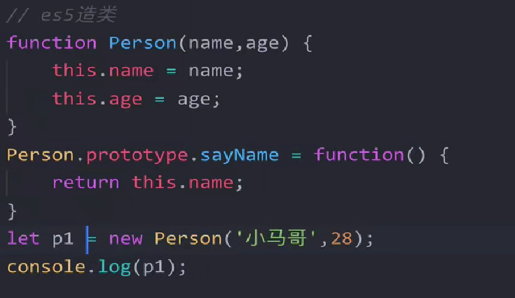

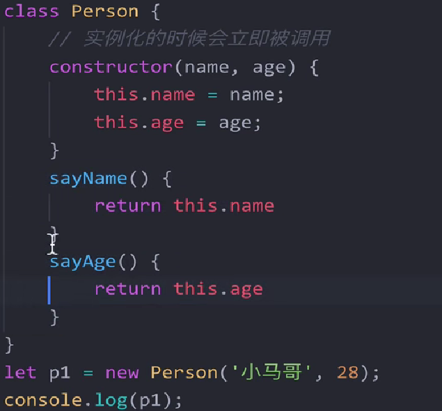

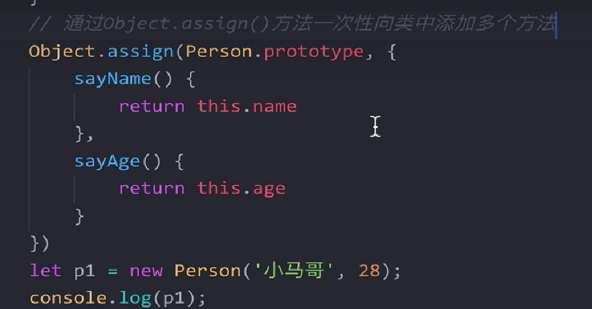

## 41.谈谈盒子模型

在**标准盒子模型**中，**width** **和** **height** **指的是内容区域**的宽度和高度。增加内边距、边框和外边距不会 影响内容区域的尺寸，但是会增加元素框的总尺寸。

**IE****盒子模型**中，**width** **和** **height** **指的是内容区域****+border+padding**的宽度和高度。

## 42.promise是什么，有哪些作用

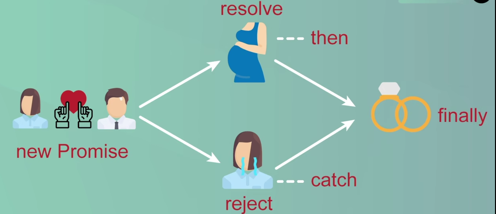

Promise 是异步编程的一种解决方案.简单说就是一个容器，里面保存着某个未来才会结束的事件

（通常是一个异步操作）的结果。从语法上说，Promise 是一个对象，可以从改对象获取异步操

作的消息。

它可以解决回调地狱的问题，也就是异步深层嵌套问题

```js
 // 1.作用：消除 异步的 回调地狱 问题

    // 2.使用：
    //     1.创建Promise实例，用这个实例去包裹异步代码
    //         const p = new Promise((resolve,reject) => {
    //             编写异步代码
    //         })
    //     2.使用Promise实例给我们提供的then方法和catch方法获取错误
    //     p.then(data => {
    //         成功
    //     }).catch(err => {
    //         失败
    //     })

    // 需求：
    //     第1秒打印1
    //     打印1后两秒打印2
    //     打印完2后三秒打印2
    
    //1.封装promise
    let p = (number,time) => {
        return new Promise((resolve) => {
            setTimeout(()=>{
                resolve(number)
            },time*1000)
        })
    }
    //2.调用函数
    //promise的链式调用
    p(1,1).then(data1 => {
        console.log(data1);
        return p(2,2)
    }).then(data2 => {
        console.log(data2);
        return p(3,3)
    }).then(data3 => {
        console.log(data3);
    })
   
```


## 43.vue-cli 2.0和3.0 有什么区别

3.0 把配置webpack的文件隐藏了，如果需要配置它需要创建一个vue.config.js文件，3.0 是2018.10月 出来的

## 44.**箭头函数有哪些特征，请简单描述一下它**

拓展运算符：将一个数组分割，并将各项作为分离的的参数传给函数

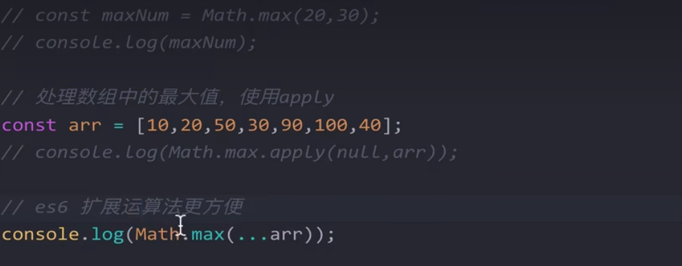

1.箭头函数与普通函数相比，它不能new，如果new的话会报错

2.箭头函数没有this，一般是全局对象，如果被普通函数包裹，那么这个箭头函数的this就指向包裹它的函数的this

而普通函数的this是动态的

3.没有congstructor，没有构造能力，用完就扔，不需要构造函数原型，不会自动生成prototype属性

4.普通的函数里面会有一个arguments对象，是一个类似数组的对象，就是函数里面的括号传入的参数，可以填任意个，这样在我们给函数传入参数的时候就可以像数组一样调用数组的元素或者属性，但是箭头函数里面没有这个，箭头函数内访问这个变量访问的是**外部执行环境**的arguments	

5.普通的函数的this可以通过call/apply/bind来强行改变this指向，但是箭头函数不可以

6.箭头函数是匿名函数，没有名字

## 45.移动端有哪些常见的问**题，都是怎么解决的**

**IOS上click点击事件会有300ms的延迟响应：**

```
换用zepto的touch模块，tap事件也是为了解决在click的延迟问题
或者引入fastclick.js解决
```

**移动端页面滚动滞涩感**

```
css在body元素上添加-webkit-overflow-scrolling: touch;
```

**软键盘与输入框问题**

h5页面有个问题就是，当输入框在最底部，点击软键盘后输入框会被遮挡。可采用如下方式解决：

```js
var oHeight = $(document).height(); //浏览器当前的高度
   
$(window).resize(function(){
    if($(document).height() < oHeight){
        $("元素").css("position","static");
    }else{
        $("元素").css("position","absolute");
    }    
});

```

另一软键盘输入框问题，也可视为fixed定位失败问题，ios下fixed元素容易定位出错，软键盘弹出时，影响fixed元素定位
1、虽然 isScroll.js 可以很好的解决 fixed 定位滚动的问题，但是不在万不得已的情况下，我们尽量尝试一下不依赖第三方库的布局方案，以简化实现方式。

解决思路：
既然在 iOS 下由于软键盘唤出后，页面 fixed 元素会失效，导致跟随页面一起滚动，那么假如——页面不会过长出现滚动，那么即便 fixed 元素失效，也无法跟随页面滚动，也就不会出现上面的问题了。配合移动端页面滚动滞涩感的解决思路css在body元素上添加-webkit-overflow-scrolling: touch;
如果考虑到更老一些的 iOS 系统不支持 fixed 元素，完全可以把 fixed 替换成 absolute 。测试后效果是一样的。

谈到了 iOS ，也来简单说一下 Android 下的布局吧。

在 Android2.3+ 中，因为不支持 overflow-scrolling ，因此部分浏览器内滚动会有不流畅的卡顿。但是目前发现在 body 上的滚动还是很流畅的，因此使用第一种在 iOS 出现问题的 fixed 定位的布局就可以了。

如果需要考虑 Android2.3 以下系统，因为不支持 fixed 元素，所以依然要需要考虑使用 isScroll.js 来实现内部滚动。

其实在 fixed 和输入框的问题上，基本思路就是： > 由于 fixed 在软键盘唤起后会失效，导致在页面可以滚动时，会跟随页面一起滚动。因此如果页面无法滚动，那么 fixed 元素即使失效，也不会滚动，也就不会出现 bug 了。

所以可以在这个方面去考虑解决问题。

至此一个不依赖第三方库的 fixed 布局就完成了

```js
// 处理iOS 微信客户端弹窗状态下调起输入法后关闭输入法页面元素错位解决办法
    var ua = window.navigator.userAgent.toLowerCase();
    if (/iphone|ipod|ipad/i.test(navigator.appVersion) && /MicroMessenger/i.test(ua)) {
      document.body.addEventListener('focusout', () => {
        console.log('focusout')
        window.scrollTo({ top: 0, left: 0, behavior: 'smooth' })
      });
    }
    //或者：
    scrollto0() {
      window.scrollTo(0, 0);
    }


```

**H5页面窗口自动调整到设备宽度，并禁止用户缩放页面**

```html
<meta name="viewport" content="width=device-width,initial-scale=1.0,minimum-
scale=1.0,maximum-scale=1.0,user-scalable=no">

```

**阻止旋转屏幕时自动调整字体大小**

```
html, body, form, fieldset, p, div, h1, h2, h3, h4, h5, h6 {-webkit-text-size-adjust:none;}

```

**移动端某些情况下input的placeholder会出现文本位置偏上的现象：**

```
PC端设置line-height等于height能够对齐，而移动端仍然是偏上，解决是设置line-height：normal

```

**修改移动端的点击高亮效果**

```
* {-webkit-tap-highlight-color:rgba(0,0,0,0);}

```

**zepto的点透问题**

```
window.addEventListener( "load", function() {
     FastClick.attach( document.body );
}, false );

```

## 46.get与post的区别

最常见的http协议的请求方式是get和post，它们之间的区别有以下几点
1、get请求的参数是放在url里面的，post请求的参数是在请求体里面
2、ger请求是可以被浏览器缓存的，post请求不能被缓存
3、get请求的参数是在url里面，url的长度是受限的，而post的长度没有限制
4、get请求放在url里安全性比较差，post请求放在body里安全性相对较好
5、get请求可以直接通过浏览器访问，支持刷新和后退，而post请求不能直接使用浏览器访问，刷新后数据要重新发送

6、get是通过地址栏来传值，而post是通过提交表单来传值

然而，在以下情况中，请使用 POST 请求：

无法使用缓存文件（更新服务器上的文件或数据库）

向服务器发送大量数据（POST 没有数据量限制）

发送包含未知字符的用户输入时，POST 比 GET 更稳定也更可靠

## 47.**什么是同源策略**

所谓同源策略是浏览器的一种安全机制，保护用户的信息安全，它只是对js脚本的限制，而不是对浏览器的限制，

对于一般的img、或者script脚本请求都不会有跨域的限制，这是因为这些操作都不会通过响应结果来进行可能出现安全问题的操作

一个域下的js脚本在未经允许的情况下，不能够访问另一个域的内容。

同源就是两个域的域名、协议、端口一致。

同源策略主要限制在三个方面

1.当前域下的js脚本不能够访问其他域下的cookie、localStorage 和 indexOB

2.当前域下的js脚本不能够访问其他域下的DOM

3.当前域下的ajax无法发送跨域请求

## 48.http状态码

http状态码是http协议的重要组成部分由三个数字组成，第一个数字定义了响应的类别，一般分为5大类，后两个数字是对该类别下的状态进行细分

| 状态类 | 状态码 | 功能       | 详情                                                         |
| ------ | ------ | ---------- | ------------------------------------------------------------ |
| 1xx    |        | 传递信息   | 服务器收到请求，需要请求者继续执行操作(实际开发中，很少遇到1xx的状态码 |
| 2xx    |        | 成功       | 请求被服务器成功接收并处理                                   |
|        | 200    |            | 客户端请求成功了                                             |
|        | 201    |            | 已创建，请求成功并创建了新的资源。                           |
| 3xx    |        | 重定向     | 需要客户端进一步操作以完成请求                               |
|        | 301    | 永久重定向 | 说明请求的资源被永久的移动到新的URI，返回信息会包括新的URI，浏览器会自动定向到新URI |
|        | 302    | 临时重定向 | 说明资源只是临时移动，客户端应继续使用原有的URL              |
|        | 304    |            | 当所请求的资源拒上一次访问，没有修改过，服务器会返回这个状态，不会返回任何资源，这个状态和HTTP的缓存机制密切相关 |
| 4xx    |        |            | 客户端出现某种错误导致请求失败                               |
|        | 400    |            | 客户端请求的语法错误，服务器无法理解                         |
|        | 401    |            | 当前请求需要用户身份验证                                     |
|        | 403    |            | 服务器已经理解了请求，但是拒绝执行它                         |
|        | 404    |            | 请求的资源不存在，服务器无法根据客户端的请求找到资源，如输入错误的url |
| 5xx    |        | 服务器错误 | 服务器在请求的过程中发生了错误                               |
|        | 500    |            | 服务器内部错误，无法完成请求                                 |
|        | 501    |            | 服务器不支持该请求方法，无法完成请求(只有get和head请求方法是要求每个服务器必须支持的，其它请求方法在不支持的服务器上会返回501) |
|        | 503    |            | 由于超载或者系统维护，服务器暂时无法处理客户端的请求         |

## 49.BFC

主要作用就是形成一块独立的渲染区域

内部元素不会影响外界

形成BFC常见的条件

浮动元素： float（除了none）

绝对定位元素： position（absolut或者flxed）

块级元素：overflow（除了visible）

flex元素

inline-block元素


应用场景

​		清除浮动等

```html
<style>
        .continer{
            background-color: skyblue;
        }
        img{
            width: 200px;
            float: left ;
        }
        .bfc{
            overflow: hidden;
        }
    </style>
</head>
<body>
    <div class="continer">
        
        <p>我是文字</p>
    </div>
</body>
```

如果此时没有加上bfc类，那么效果如下


div只计算了p标签的高度，而不计算图片的高度了，因为图片使用了浮动，盒子找不到撑起它的img子元素，此时盒子会塌陷，只计算文字的高度

但是如果使用了BFC，也就是加上bfc类，效果便如下

```html
<div class="continer bfc">
```


这是因为盒子使用了BFC，盒子变成了一块独立的渲染区域，里面的内容不会影响外面，盒子里的img即使浮动也不会跑到外面去了，只能在盒子里面，此时盒子就能找到img，根据img的高度来撑起盒子的高度


但是此时还有一个问题，就是文字实际上的宽度是整个盒子的宽度，它并没有减去被img所占的那部分，这是因为p标签里面的内容也影响到了外面

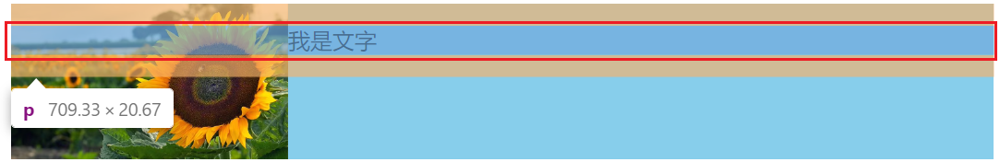

此时给p标签也加上BFC，就可以解决该问题

```html
<p class="bfc">我是文字</p>
```


## 50.token是什么

token的意思是“令牌”，是服务端生成的一串字符串，作为客户端进行请求的一个标识
当用户第一次登录后，服务器生成一个token，并将此token返回给客户端以后客户端只需带上这个token前来请求数据即可，无需再次带上用户名和密码
简单token的组成:

uid+time+sign(签名)+[固定参数]

uid(用户唯一的身份标识)
time(当前时间的时间戳)
sign (签名:将请求URL、时间截、uid进行一定的算法加密)

固定参数(可选): 将一些常用的固定参数加入到 token 中是为了避免重复查库

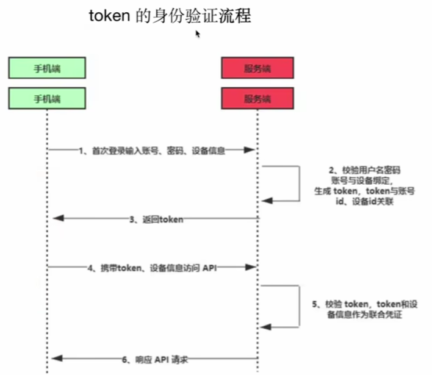

优点:

1、与session对比，可以跨服务器
避免cookie存储遭受CSRF(跨站请求伪造的攻击)以及cookie跨域限制问题

JWT区别:

JWT: Json Web Token有自己的一套规则是无状态的，不用将token存储在内存或者db中也不用自己另外去储存过期时间


**为什么token要同时存在vux和localStorage中**

因为vuex中的数据是响应式的，就是其中一处发生变化，其他的组件里面的数据也随之变化

但是页面一刷新，vuex中的数据就需要初始化，这时候里面的token就没了，需要重新请求，这样比较麻烦

所以需要将数据存到localstorage中，因为localStorage的数据是持久化的，不是响应的，页面刷新也不会清空数据，然后让vuex获取localStorage中的token，这样即使刷新页面，vux也能读取到localStorage中的数据，这样就能让用户在一定的时间段内都能保持登录状态

如果想要让用户每次访问页面时都重新登录的话，就需要将token放在sessionStorage中，页面销毁，清空token

## 51.js的数据类型有哪些

```js
 共有七种
    基本数据类型：String、number、boolean、null、undefiend、symbol（代表创建之后独一无二并且不可变的数据类型）
    引用数据类型：Object
    区别：
        1.声明变量时的储存分配
            基本数据类型存储在栈中，栈是由操作系统自动分配内存空间，主要用来储存一些基本变量，以及对象的一些引用变量，占据的值固定大小的空间
                如var a = 10  这是一个number数据类型，它的内存大小已经确定了，后面无论a = 20或者a = 100，所占的内存空间都是固定的了
            引用数据类型存储在堆中，堆是由操作系统动态分配内存空间，大小是不一定的，主要是用来存放引用数据类型
                如var arr = [1,2,3,4,...] 这是一个数组，数组里面如果继续添加值，那么这个数组所占的内存空间也必须要增大，
                所以我们把这样的数据放在堆里面，因为堆是动态的分配内存空间
        2.不同的内存分配机制也带来了不同的访问机制
            不可以直接访问堆内存空间的位置，以及直接操作堆内存空间，因为我们的数组和对象都是存储在堆内存中，那么我们要怎么对他们进行操作呢
            因为堆内存存放的是数组和对象的实体，栈内存里面会有一个引用地址，通过操作这个引用地址来对堆内存中的数据进行操作
            因为本数据类型是存储在栈中，便可以直接访问基本数据类型。
            而引用类型访问引用地址，根据引用地址找到堆中实体
        3.复制变量时的不同
            基本数据类型：var a = 1，var b = a，将原始值的副本赋值新的变量
            引用数据类型：var obj = {name：'张三'}，var obj1 = obj ，将引用地址赋值给新的变量 
    var a = [1,2,3,4,5];
    var b = a;
    var c = a[0];
    console.log(b);//1,2,3,4,6  这里为什么6而不是5呢，是因为console.log 执行的时候，chrome 会对 log 的对象求一次值，打印出来是 Object ，
                   //可以继续展开的，只有继续展开才能看到数组里面的值。
                   //但当你展开控制台中的 Object 的时候，chrome 又会对它求一次值，这一次是显示它的属性，也就是显示该对象在内存中最新的状态
                   //因为下面的b[4] = 6，堆内存中的的数据已经发生了改变，展开控制台的Object也就是显示最新的堆内存数据
    console.log(c);//1
    // 改变数值
    b[4] = 6;
    c = 7;
    console.log(a[4]);//6
    console.log(a[0]);//1
```

## 52.**在浏览器输入URL回车之后发生了什么**

1**、输入ＵＲＬ**

首先检查输入的内容是否是一个合法的URL连接

如果合法的话，则判断输入的URL是否完整，如果不完整，浏览器可能会对地址进行猜测，补全地址的前缀或者后缀

如果不合法，将输入内容作为搜索条件，使用用户设置的默认搜索引擎来进行搜索，大部分的浏览器会从历史记录或者书签等地方开始查找我们输入的内容，并给出只能提示

**２、DNS解析**

浏览器不能直接通过域名找到对应的服务器IP地址 

我们需要用DNS将URL（域名）地址解析成ip地址，这一过程叫做DNS解析，其实DNS就是一个数据库，这个数据库里面记录着很多URL和对应的IP地址，这样我们就可以用DNS根据URL来找到IP地址了

首先用户在浏览器中输入域名，              																																																			1.操作系统会检查浏览器缓存和本地的hosts文件中是否有这个网址记录，有的话就从记录里面找到对应的IP地址，完成域名的解析  

2.没有的话就再接着使用tcp ip 参数中设置的DNS服务器进行查询，如果要查询的域名包含在本地配置区域中，则返回解析结果，完成域名的解析 

3.还没有的话，再接着检查本地DNS服务器是否缓存有盖网址记录，有的话就返回解析结果，完成域名的解析

4.如果还没有的话，服务器会发送查询报文到根DNS服务器，根DNS服务器收到请求后，返回dinji域DNS服务器地址 ，然后本地DNS服务器再发送查询报文到dinji域DNS服务器，inji域DNS服务器收到请求后，返回权威DNS服务器的地址，然后本地DNS服务器再发送查询报文到权威DNS服务器，然后权威DNS服务器收到请求后呢，返回最终的IP地址，完成域名的解析


有了IP地址我们就可以在互联网里找到指定的服务器了

**３、建立TCP连接**

当浏览器获取到服务器的IP地址后，浏览器会用一个随机的端口号，向服务器80端口发起TCP连接请求，这个连接请求到达服务端之后，通过TCP三次握手建立TCP连接

三次握手
A: 是A吗？我要跟你通信，你听得到吗？
B：可以听到，你听得到吗？
A：我可以听到

​		tcp三次握手其实就是建立一个TCP连接，客户端与服务器交互需要三个数据包，握手的主要作用就是为了确认双方的接受和发送能力是否正常，初始序列号，交换窗口大小等信息，

​	首先一次握手客户端发送syn报文，并进入syn_send状态，等待服务器确认，

​	第二次握手服务器收到syn报文，需要给客户端发送ACK确认报文，同时服务器也要向客户端发送一个syn报文，所以也就是向客户端发送syn加ack报文，此时		服务器进入syn_rcvd状态，

​	第三次握手，客户端收到SYN加ACK报文，向服务器发送确认包，客户端进入Established状态，待服务器收到客户端发送的ack报文，也会进入Established的状		态，完成三次握手


回答时可以简单概述TCP过程，三次握手具体描述时需要说明状态的基本转换

​	TCP三次握手其实就是TCP应用在发送数据前，通过TCP协议，跟通信对方协商好连接信息，建立起TCP的连接关系

​	TCP连接并非时在通讯设备两端之间建立通信隧道，而本质上是双方各自维护所需的状态，以达到TCP连接的效果


TCP连接为什么需要三次握手，两次握手可以吗？

​	确认双方的收发能力

​			TCP建立连接之前需要确认客户端以服务器双发的收包和发包的能力，

​			首先一次握手，客户端发送网络包，服务器收到了，这样服务器就能得出结论，客户端的发送能力，服务端的接受能力是正常的

​			第二次握手，服务端发包，客户端收到了，这样客户端就能得出结论，服务端的接收发送能力与客户端的接收能力是正常的，不过此时服务端并不能确认客					户端的接受能力是否正常

​			第三次握手，客户端发包，服务器端收到了，这样服务器端就能得出结论，客户端的接受发送能力正常，服务器自己的发送接收能力也正常

​			所以只有三次握手才能确认双放的接受与发送能力是否正常

​	序列号可靠同步

​			如果是两次握手，服务端无法确认客户端是否已经接收到了自己发送的初始序列号，如果第二次握手报文丢失，那么客户端就无法知道服务端的初始序列号

​				那TCP的可靠性就无从谈起了

​	阻止重复历史连接的初始化

​			客户端由于某种原因，发送了两个不同序号的syn包，但是网络环境是复杂的，旧的数据包有可能先到达服务器，如果是两次握手，服务器收到旧的syn就					会立刻建立连接，那么就会造成网络的异常，如果是三次握手，服务器需要回复syn加ack包，客户端会对比应答序号，如果发现是旧的报文，就会给					服务器发送rst报文，直到正常的syn到达服务器后，才正常的建立连接，所有三次握手才有足够的上下文信息来判断当前连接，是否是历史连接

​	安全问题

​			我们知道TCP新建连接时，内核会为连接分配一系列内存资源，如果采用两次握手就建立连接，那么会放大DDOS攻击，TCP作为一种可靠的传输控制协				议，其核心思想就是既要保证数据可靠传输，又要提高传输的效率，而三次握手恰好可以满足以上两方面的需求

​	什么是半连接队列

​			服务器第一次收到客户端的syn之后就会处于syn_rcvd的状态，此时双方还没有完全建立连接，服务器会把这种状态下的请求连接放在一个队列里，我们把				这种队列称之为半连接对列，当然还有一个全连接队列，就是已经完成了3次握手建立起连接的就会放在全连接队列中，如果队列满了，就有可能会出现					丢包现象

三次握手可以携带数据吗？

​	第一次和第二次握手不可以携带数据，而第三次握手是可以携带数据的，因为如果第一次握手可以携带数据的话，如果有人要恶意攻击服务器，那他每次都在第		一次握手的syn报文中放入大量的数据，疯狂的重复发syn报文，这会让服务器花费大量的内存空间来缓存这些报文，这样服务器就更容易收到攻击，对于第		三次	握手，此时客户端已经处于连接状态，他已经知道服务器的接受发送能力是正常的了，所以可以携带数据

四次挥手：
客户端：1.我要关闭连接了
服务端：2.收到
服务端：3.那么我这边也关闭连接了
客户端：4.好的


三次握手就像，先敲门请求进门，得到回应以后才表示同意进门，然后才可以进门

**4.发送ＨＴＴＰ请求**

当我们和服务器建立连接以后，浏览器是会发送ＨＴＴＰ请求报文给服务器，进行数据的传输了，

如果使用的HTTPS，会在TCP与HTTP之间多添加一层协议，作为加密及认证的服务

​	HTTPS 使用ssl和tls协议，保障了信息的安全，

​			ssl协议的作用是认证客户端和服务器，确保数据发送到了正确的客户端和服务器，加密数据，防止数据中途被窃取

​			tls协议的作用是用于在两个通信应用程序之间提供保密性和数据完整性，tls协议有两层组成，tls记录协议和tls握手协议


报文的格式就由请求行、请求头部、空行、请求数据组成

请求行：请求方法+请求地址+HTTP协议版本组成

请求头部：一些关于浏览器的信息，由键/值对组成，一行一对，直到遇到空行，就表示下面没有请求头部了

空行：

请求数据：需要什么数据就以什么样的形式获取数据，这样服务器才知道我们想要获取什么信息

****

**5.响应 H T T P 请求报文**

当浏览器到外部服务器连接建立以后，浏览器会发送一个初始的HTTP GET 请求，请求目标通常是一个html文件，服务器收到请求后，将发回一个HTTP的响应报文，内容包括相应的响应头和HTML正文 

服务器收到HTTP请求报文后就会响应请求，报文的格式有状态行、响应头部、空行和响应数据组成

状态行：三位数字（如常见的404 Not Found表示资源没找到的错误，200 响应成功）

响应头部：由键/值对组成,一行一对，直到遇到空行就表示下面没有响应头部了

空行：

响应数据：请求方式要什么，就响应什么

6.**页面渲染**

浏览器在接收服务器的响应以后，页面就会开始渲染，也就是解析接收到的HTML、CSS、JS等文件

有了这些前端文件以后，用户就可以在前端看到页面内容了

但是不同的浏览器渲染过程是不太一样的

以谷歌为例：

​	1、首先处理HTML标记并构建DOM树

​	2、处理CSS标记并构建CSSDOM树

​	3、将DOM树与CSSDOM 树合并成一颗渲染树

​	4、根据渲染树来布局，以计算每个节点的几何信息

​	5、将各个节点渲染到屏幕上

**7.断开TCP连接**

现在的浏览器页面为了优化请求的耗时，默认都会开启持久连接，也就是说标签页关闭的时候，TCP连接才会关闭

这个关闭的过程就是四次挥手


## A：前后端分离

它本身不是一个技术问题，而是一个工程化考量 和 项目管理的问题，为了提高工作效率

​	因为初期的软件开发是趋向于后端的，因为初期的互联网页面功能比较简单，只需要提供数据的展示，提供基本的操作就行了

​	所以整个项目的重点就放在后台的业务逻辑处理上，但是随着业务和技术的发展，前端功能越来越复杂，越来与重要，前端的技术栈也越来越丰富，体量也越来	越大，解决前端问题的难度也越来越大，此时前端开发不能再像以前那样零散的分布在整个系统架构当中，前端也应该像后端一样，实现工程化、模块化、系统	化

​	此时就需要成立专门的前端部门，将其与原本的后端程序员混合在一起的前端开发统一集中起来，形成一个纯粹的前端部门，专门去研究开发工程化的前端技	   	术，迭代升级新的技术体系，以解决项目中的问题，适应技术的发展，总而言之，就是为了适应技术和业务发展的需求，前端需要从前后端混合开发中分离出来

一个正常的软件开发，简化来讲有四大步，设计——开发——测试——部署

真正的前后端分离应该渗透到每一个步骤中

设计阶段

​		设计的第一个层面当然是系统设计，假如你的网站页面极其多、非常复杂，这时候前端项目架构也得做好充分的规划和准备，一定要满足一个长期可演进、可				迭代都目标，这个其实在设计阶段也得考虑

​		设计的第二个层面就是所谓的接口设计，前后端分离后，前后端系统通过接口进行交互，这个时候模型（Model）层面的接口约定极其重要，接口的请求方				式、数据类型、数据的格式等等一定要评审到位，不然就会前后端因为接口问题扯皮

开发阶段

​		前后端各自按照事前约定的接口独立去开发，

​		前端可以使用较火的Vue或者React组件化框架的帮助，独立的去驱动页面，独立的开发，数据也可以从事先规划好的mock服务器去拿，数据全是模拟出来				的，完全不需要依赖实时的后端接口，

​		后端也只需要把接口写好、提供好，按照之前评审好的接口约定来提供数据即可  ，而且前后端分离之后，后端的一套接口可以提供给很多类型的前端使用

​				如Web网页、手机APP、小程序、h5页面

测试阶段

​		基本上要保证的是前后端独立可测试，

​		前端主要就是页面、跳转、展示、输入，还有一些传参、响应数据的展示等等

​		后端则主要保证数据接口的提供 ，数据格式、校验、异常情况、数据的一致性问题、权限问题

部署上线阶段

​		前后端分离之后，前后端项目独立可部署，前端所有的事情都可以全部自己单独去做，前端项目也可以去单独独立部署，而且前后端发布上线可以完全独立，				双方可以按照自己的版本规划来发版本，前端发版本不受后端约束，后端发版本前端也可以完全不知道

​		

前后端分离需要成本（完整的前后端分离需要考虑设计，测试，部署需要投入的人力成本和运营成本会更高）。
不是所有项目都适用前后端分离，依据项目复杂程度和后续迭代计划进行相应的取舍。

## 53.XSS与CSRF

XSS -- 侧重于脚本，千方百计的注入并执行恶意脚本

- xss**危害**


- xss**攻击方式**


任何用户可以输入的地方都有可能被攻击，所以对于前后端来说，一切用户输入都是不安全的

- xss**分类**


​		反射型与DOM型

​			

​				二者区别

​					

储存型（危害最大，因为储存时间最久）


- xss**攻击的预防**

    - xss的攻击方式是先注入后执行所以我们只需要对xss恶意代码防止注入、防止执行就行要对用户的输入和输出进行严格把控

    

    

    - xss**预防方法**

        ​	**`DOMParser`** 可以将存储在字符串中的 [XML](https://developer.mozilla.org/zh-CN/docs/Glossary/XML) 或 [HTML](https://developer.mozilla.org/zh-CN/docs/Glossary/HTML) 源代码解析为一个 DOM [`Document`](https://developer.mozilla.org/zh-CN/docs/Web/API/Document)。

        ​	你可以使用[`XMLSerializer`](https://developer.mozilla.org/zh-CN/docs/Web/API/XMLSerializer) 接口执行相反的操作 - 将 DOM 树转换为 XML 或 HTML 源。

        

CSRF -- 不注入恶意脚本，侧重于请求伪造借刀杀人，在用户不知情的情况下，借用户的名义干坏事

​	用户访问a网站并登录，在本地的cookie里面就会存储登录信息，然后黑客在网站a里面放弹窗b或者链接b之类的，用户不小心点击进去后，b网站就会返回恶意		代码并请求网站a，网站a就会认为是用户自己发送的请求，并用用户的权限去处理此请求

​	CSRF漏洞的检测方法

​			在目标网站抓取一个正常请求的数据包，去掉Referer字段之后再次发给目标，如果该提交还有效，那么就基本可以确定该网站存在CSRF漏洞

防御方法

​		1.尽量使用 POST

​				因为get请求更容易受到攻击

​		2.加入验证码

​				图片验证或者数字验证

​		3.验证 Referer

​				请求里面会有一个Referer，里面包含了请求源，也就是哪个网页发起的请求，如果不是原网页发起的请求，就拒绝访问

​		4.Anti CSRF Token

​				在header或者form表单里面加入随机的token值，服务端进行验证，验证通过之后销毁taken，然后再给客户端随机生成一个token

​		5.加入自定义 Header

​				与方法4相同，只不过该方法只能在header中使用

## 54.**CSRF 和 XSS 的区别**

**区别一：**

CSRF：需要用户先登录网站 A，获取 cookie

XSS：不需要登录。

**区别二：（原理的区别）**

CSRF：是利用网站 A本身的漏洞，去请求网站 A的 api。

XSS：是向网站 A 注入 JS代码，然后执行 JS 里的代码，篡改网站 A的内容

## 55.cookie 和 session 和 token 的区别

服务器验证是前提。cookie保存在客户端，服务器不加密不保存；session保存在客户端，服务器要加密并保存；token保存在客户端，服务器要加密不保存。

http无状态

​		http是无状态的，也就是说你这次访问了服务器，关闭网页，再次访问服务器，服务器是没有意识到又是你来访问

​		一般都是让浏览器储存一定期限的账户和密码，然后比对数据库保持登陆状态

cookie

​		浏览器发起了http请求，服务器会进行Cookie设置，也就是Set-Cookie，Cookie里面有名和值两个重要属性，服务器会把名和值属性里的内容给填充完整

​		cookie发给浏览器以后，浏览器会保存起来，这样浏览器以后发送的每一个请求都会自动附上这个Cookie，说白了，Cookie就是一种储存在浏览器的数据

​		但是Cookie不安全，如果电脑被黑，那么本地的Cookie保存的数据就会泄露

seeesion

​		也就是会话，因为浏览器和服务器是进行会话的，浏览器访问服务器就是会话的开始，比较模糊的是结束会话的时间，因为关掉网页也可能是按错了，因此每		一个网站对每个用户的会话都设定了时间以及唯一的ID，就是Session ID，这里的时间也就是结束会话时间，因为是服务器定义的，所以保存在服务器里

​		用户输入账号和密码，服务器就会返回一个Session ID，然后浏览器会把这个Session Id储存在Cookie里面，然后把结束会话的时间设置为Cookie的有效期，		Session ID是一串没有规则的字符串，就算黑客拿到了Session ID 也没有多大作用了，因为服务器在发送Cookie之前是会对这个含有Session ID 的Cookie进		行签名，如果黑客修改了Session ID,Session ID就会变成服务器识别不了的字符串，所以浏览器保存了Cookie以后，利用Cookie的核心特点，也就是每个请		求，都会自动发送Cookie到响应的服务器那里，也就是说在Cookie的有效期内，每次访问服务器，都会发送Session ID 到服务器，此时会话就结束了，然后		等Cookie失效后，用户就得重写输入用户名和密码了 ，但是大量Session ID储存在服务器，会增加服务器的压力

 JWT

​		用户登录网页之后，服务器就会生成一个JWT，服务器不需要保存JWT，只需要保存JWT签名的密文，接着把JWT发送给浏览器，可以让浏览器以Cookie或者Storage的形式进行存储，假设以Cookie的方式保存下来，这样用户每次发送请求都会把这个JWT发送给服务器，用户就需要重新输入账号密码了，和Session很类似，这里的Token只不过是存储在用户这里


Cookie是最早诞生，用于保存一些数据到本地，这样可以让下次发送Http请求携带上这些数据，可以做到让服务器认得这个请求之前就请求过，然后查看一些携带过来的相关数据。这样就做到了解决Http请求完全没有状态的问题。
但是缺点是:
保存在客户端，不安全；
大小空间只有4k，不够用，如果是加密的信息往往是会让原本的信息大很多；

为了解决这个问题，推出Session。Session保存在服务器中，它的由服务器保存，这样就解决了不安全+不够大的问题。由cookie保存一个session的id，每次请求只需要携带该id就可以在服务器找到对应的Session空间。如果没有找到id则由服务器发送一个id保存在浏览器的cookie里。

缺点:在微服务架构中，往往服务器是多台的，每台服务器都是保存相同的内容，处理相同的功能。所以当其中一个服务器里对应某个浏览器的Session数据发生改变，其它服务器也需要最改变。后端的解决方法是在使用一个中间件进行处理，让它接收前端传来的sessionid，再进行分发到所有服务器中。
但是！这需要💰➕人力 总结就是费钱费力。

那么小公司我不搞中间件怎么办呢？
Token诞生了。它返璞归真，Session和服务器打交道麻烦是吧？好，我不和服务器打交道了，我才用Cookie的方式保存在本地。
但是Cookie不安全？我进行加密！
但是Cookie不够大？Html5以后多了localStorage这个存储方式，它可是很大的！
以后我每次直接携带加密数据过去，后端收到直接解析就行了

缺点:还是不够安全，但是省事 省钱

## 56.**call、apply、bind三者的异同**

共同点 : 都可以改变this指向; 不同点: call 和 apply 会调用函数, 并且改变函数内部this指向. call 和

apply传递的参数不一样,call传递参数使用逗号隔开,apply使用数组传递 bind 不会调用函数, 可以改变函

数内部this指向

```js
<script>
    function fun(){
        console.log(this.name);
    }
    let cat = {
        name:'喵喵'
    }
    let dog = {
        name:'旺财',
        sayName(){
            console.log('我是'+this.name);
        },
        eat(food1,food2){
            console.log(this.name+'喜欢吃'+food1+'和'+food2);
        }
    }
    // 改变fun的this指向为cat，原本指向window
    fun.call(cat);
    // 改变sayName的指向为cat，原本指向dog
    dog.sayName.call(cat);
    // 改变eat的指向为cat，原本指向dog，这里的eat需要参数，那么call里面的第一个参数为需要指向的对象，第二个参数就为方法所需要的参数，
    //     如果eat方法需要传两个参数，那么就在call里面继续添加参数，反正call方法里面第一个参数为所需要指向的对象，后面的都为要改变指向的方法所需要的参数
    dog.eat.call(cat,'鱼','肉');
    dog.eat.apply(cat,['鱼','肉']);//apply与call的不同就是call是一个个参数，而apply是数组形式
    let ff = dog.eat.bind(cat,'鱼','肉');//call和apply会调用函数，而bind不会，bind是作为一个返回值返回一个函数，然后才能调用
    ff()
</script>
```

## 57.性能优化

加载时的优化

**1.减少http请求**

 	http请求需要经历  DNS查找—> TCP握手—>浏览器发出Http请求—>服务器接受		请求—>服务器处理请求并发回响应—>浏览器接受响应

​	当请求过多时，就会消耗性能，这就是为什么需要将多个小文件合并成大文件

**2.服务器端渲染**

​	客户端渲染是获取html文件，根据需要下载js文件，运行文件，生成DOM再渲染，会拖慢性能

​	服务器端渲染，客户端只需要解析HTML文件即可

**3.静态资源使用CDN**

​	cdn就是内容分发网络，他是一组分布在多个不同地理位置的web服务器，当服务器离用户越远时延迟越高，cdn就是解决这个的，在多个位置部署服务器，让用户离服务器更近，从而缩短请求时间

**4.CSS写头部，JavaScript写底部**

​	所有放在head标签里的CSS和JS文件都会堵塞渲染。如果这些CSS和JS需要加载和解析很久的话，那么页面就空白了。

所以JS文件要放在底部，等HTML解析完了再加载JS文件。

那为什么CSS文件还要放在头部呢？因为先加载HTML再加载CSS，会让用户第一时间看到的页面是没有样式的、“丑陋”的，为了避免这种情况发生，就要将CSS文件放在头部了。

另外，JS文件也不是不可以放在头部，只要给script标签加上defer属性就可以了，异步下载，延迟执行。

**5.字体图标代替图片图标**

字体图标就是将图标制作成一个字体，使用时就跟字体一样，可以设置属性，例如fontsize、color等等，非常方便。并且字体图标是矢量图，不会失真。还有一个优点是生成的文件特别小。

**6.利用缓存不重复加载相同的资源**

为了避免用户每次访问网站都得请求文件，我们可以通过添加Expires来控制这一行为。Expires设置了一个时间，只要在这个时间之前，浏览器都不会请求文件，而是直接使用缓存。

**7.图片优化**

​	图片延迟加载：先不给图片设置路径，只有当图片出现在浏览器的可视区域时，								才去加载真正的图片，

​	降低图片质量；PS切背景图时，将图片切成JPG格式，并且将它压缩到60%的质								量，这样基本看不出来区别

​	CSS3效果代替图片：有很多图片使用CSS效果（渐变、阴影等）就能画出来，

​	雪碧图：实际是指CSS中的图片拼合技术，将多个背景图拼合在同一张图片上，在					使用时按照需求对图片位置进行改动。

运行时的优化

**1.减少重绘重排**

​	用JavaScript修改样式时，最好不要直接写样式，而是替换class来改变样式。

**2.事件委托**

**3.不要覆盖原生方法**

**4.降低CSS选择器的复杂性**

​	浏览器读取选择器，遵循的原则是从选择器的右边到左边读取。所以，尽可能的降低CSS选择器的复杂性

**5.使用flex布局**

**6.css使用transform和opacity**
